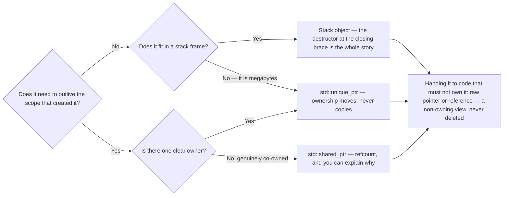
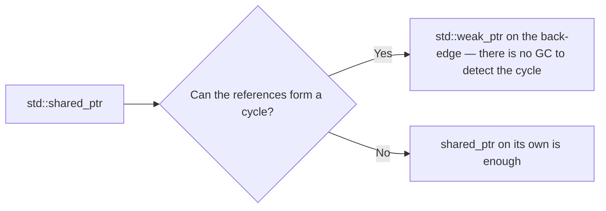

# Part I — The Mental Shift

Two standing offers before anything else. If `*`, `&`, `->`, `const`, `size_t` or `explicit` are rusty — or new — read [Appendix A](A-fundamentals-refresher.md#appendix-a--fundamentals-refresher) first: ten minutes, then come back; Chapter 1 uses all of them without slowing down. And none of these chapters is meant to be taken on trust. Every snippet in Parts I–IV runs with one line:

```bash
clang++ -std=c++17 -Wall -Wextra file.cpp -o t && ./t
```

(`g++` spells it the same; MSVC is `cl /std:c++17 /W4 /EHsc file.cpp`, and the full toolchain story is [Chapter 13](13-toolchain-quick-reference.md#chapter-13--toolchain-quick-reference).) The **Try it** paragraphs scattered through these chapters are thirty-second uses of that line: predict out loud first, then run. Being wrong in under a minute is the cheapest lesson this book can sell you.

---

## Chapter 1 — Ownership and RAII

In C#, you create objects and forget about them — the garbage collector cleans up eventually. In C++, **someone** must be responsible for deleting every object. That someone is the **owner**. RAII is the technique that makes ownership automatic instead of manual.

**RAII = Resource Acquisition Is Initialization.** Terrible name, simple idea: tie a resource's lifetime to an object's lifetime. Acquire the resource (memory, file, mutex lock) in the constructor, release it in the destructor. C++ **guarantees** the destructor runs when an object goes out of scope — including while an exception unwinds the stack past it — so cleanup becomes automatic. Think of it as C#'s `using` block, except it is the default behavior of the whole language. (Two escape hatches worth knowing early, though neither shows up in ordinary code: `std::exit` abandons every local without running its destructor — objects with static storage duration still get theirs — while `abort` runs no destructors at all, and if an exception is never caught anywhere, whether the stack unwinds before `std::terminate` is left to the implementation.)

```cpp
void ProcessFile() {
    std::ifstream file("data.txt"); // opened here
    // ... use file ...
}   // <- destructor runs HERE, file closed. Always. No finally needed.
```

**Try it (30 seconds).** Give a struct a printing destructor, make one local in `main` and one at namespace scope, and end `main` twice — once with `return 0;`, once with `std::exit(0);`. Predict which `~` lines each run prints before you look: that is the guarantee above, and its escape hatch, observed.

### The old bad way that RAII replaces

```cpp
Widget* w = new Widget();
DoStuff(w);      // if this throws...
delete w;        // ...this never runs. Memory leak.
```

### Smart pointers — RAII for heap memory

**`std::unique_ptr<T>`** — your default. Exactly one owner. Cannot be copied, only *moved* (ownership transfers). The same size as a raw pointer, and the same generated code as correct manual `new`/`delete` — which is the honest version of "zero cost". Not *literally* free: the destructor carries a null check, and because the type is non-trivial the Itanium ABI passes a by-value `unique_ptr` parameter through memory rather than a register. Neither has ever been why a program was slow. It is also where an object goes that is simply too big for a stack frame — [Chapter 3](03-stack-heap-and-undefined-behavior.md#chapter-3--stack-heap-and-undefined-behavior) has the sizes, and Recipe 34 in [Appendix F](F-rosetta-cookbook.md#appendix-f--the-rosetta-cookbook) the shape.

```cpp
auto w = std::make_unique<Widget>();
// no delete anywhere, ever. When w goes out of scope, Widget dies.
```

**`std::shared_ptr<T>`** — multiple owners with a reference count; the object dies when the count hits zero. Closest to C# object semantics, but it has real cost (atomic counter). Using it everywhere is a code smell. Rule of thumb: *unique_ptr unless you can explain why shared*.

**`std::weak_ptr<T>`** — observes a shared_ptr without owning it. Solves the cycle problem: two objects holding shared_ptrs to each other never hit zero and leak — there is no GC to detect cycles like in C#. Pattern: parent holds shared_ptr to child, child holds weak_ptr back.

The whole decision, for any object you are about to create — including the one question C# answered for you:



And the one follow-up question that only the shared branch raises:



### Transferring ownership with unique_ptr

```cpp
std::unique_ptr<Widget> MakeWidget() {
    return std::make_unique<Widget>();   // ownership moves out
}
void Take(std::unique_ptr<Widget> w);    // ownership moves in

int main() {
    auto w = MakeWidget();       // I own it now
    // auto w2 = w;              // ERROR: can't copy
    auto w2 = std::move(w);      // OK: ownership transferred, w now empty
    Take(std::move(w2));         // gave it away
}   // nothing to clean up - Take's parameter deleted it
```

### The shared_ptr cycle trap

```cpp
struct Child;
struct Parent { std::shared_ptr<Child> child; };
struct Child  {
    std::shared_ptr<Parent> parent;  // BAD: cycle! Neither hits refcount 0
    // std::weak_ptr<Parent> parent; // GOOD: breaks the cycle
};
```

### Two spellings you will read before you write them

A `unique_ptr` with a **custom deleter** is the RAII guard for a resource whose release is one function call — Recipe 7 in [Appendix F](F-rosetta-cookbook.md#appendix-f--the-rosetta-cookbook) is the shape, with `&std::fclose` as the deleter; reach for it when the release is one call, and write the class below when there is more to manage than that. `shared_ptr` takes a deleter too, and [Chapter 35](35-still-live-at-unload.md#chapter-35--still-live-at-unload) says why that is one constructor short for a refcounted handle.

The odd one out is `std::enable_shared_from_this<T>`: it lets an object hand out a `shared_ptr` — or, more usefully, a `weak_ptr` — to *itself* from inside a member function, provided it is already owned by a `shared_ptr`. It exists for exactly the situation [Chapter 29](29-concurrency.md#chapter-29--concurrency) builds by hand with a separate control block, a callback that must ask "is the thing I point at still alive?" without being handed a raw `this`. Calling it on an object no `shared_ptr` owns throws `bad_weak_ptr` since C++17; before that it was undefined behavior, which is the version you will meet in older code.

### Writing your own RAII wrapper (a shape to know cold)

```cpp
class FileHandle {
    FILE* f;
public:
    explicit FileHandle(const char* path)      // 'explicit': Appendix A.3
        : f(std::fopen(path, "r")) {
        if (!f) throw std::runtime_error("open failed");
    }
    ~FileHandle() { if (f) std::fclose(f); }   // cleanup guaranteed

    // forbid copying (two copies would close the same file twice)
    FileHandle(const FileHandle&) = delete;
    FileHandle& operator=(const FileHandle&) = delete;

    FILE* get() const { return f; }
};
```

The shape: acquire in constructor, release in destructor, delete the copy operations.

### RAII for a lock — compare to C# lock statement

```cpp
std::mutex m;
void AddItem() {
    std::lock_guard<std::mutex> guard(m);  // locks now
    items.push_back(42);
}                                          // unlocks here, always
```

### In the wild: C-style SDKs

Vendor SDKs — plug-in APIs, device SDKs, OS APIs — hand you raw resources (allocated payloads, handles, sessions) that you must release manually via a matching dispose/close/free function. The pro move is a small RAII guard per resource type, so the release runs on every path, including early error returns. Here is the shape against the miniature SDK you will meet in Chapter 17 (`ThingData` is a struct whose payload the SDK allocates and you must dispose):

```cpp
class ThingDataGuard {
    ThingData& data_;
public:
    explicit ThingDataGuard(ThingData& d) : data_(d) {}
    ~ThingDataGuard() { Thing_DisposeData(&data_); }
    ThingDataGuard(const ThingDataGuard&) = delete;
    ThingDataGuard& operator=(const ThingDataGuard&) = delete;
};

ErrCode ReadThing(size_t index, double* sum) {
    ThingData data = {};                       // zero-init: API struct idiom
    ErrCode err = Thing_GetData(index, &data);
    if (err != NoErr) return err;              // nothing allocated on failure

    ThingDataGuard guard(data);                // from here, disposal guaranteed
    return Thing_SumValues(&data, sum);        // early returns are now safe
}   // payload disposed automatically
```

Without the guard, every early `return` needs its own dispose call — the exact bug pattern legacy plug-in code is full of. Writing the guard is a five-minute investment that eliminates a whole leak class; this pattern is the workhorse of professional SDK code.

> [!TIP]
> **Key principle:** "In C++ I think in terms of ownership. Every resource has exactly one clear owner, expressed with unique_ptr or stack allocation. I basically never write new or delete by hand — raw new/delete in code is a bug waiting to happen."

---


<!-- nav:begin -->
[Contents](README.md) · [Chapter 2 — Value Semantics →](02-value-semantics.md)
<!-- nav:end -->
