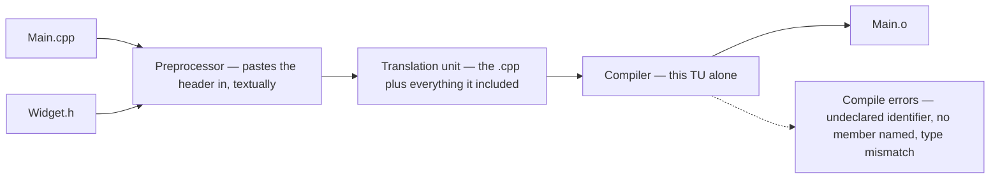
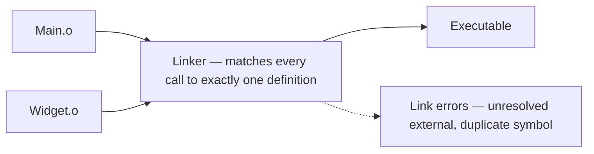

# Part IV — The Build and the Toolchain

---

## Chapter 12 — The Compilation Model

In C# the compiler sees the whole project at once and assemblies carry metadata. C++ compilation is a relic of the 1970s that you must understand, because half of all confusing C++ errors are build-model errors, not logic errors.

### The pipeline

1. **Preprocessor** — dumb text machine. `#include "Widget.h"` literally copy-pastes the file's contents into your source.
2. **Compiler** — compiles each .cpp file completely independently into an object file (.obj/.o). Each .cpp + everything it included = one **translation unit**. The compiler has no idea other .cpp files exist.
3. **Linker** — stitches all object files together, matching "I call function X" with "here's the body of X".

The pipeline in two pictures, because its two halves fail differently — and knowing which half you are looking at is the whole skill. Stages 1 and 2 run once per .cpp, in isolation. This is `Main.cpp`'s trip; `Widget.cpp` makes exactly the same one, and neither knows the other exists:



Stage 3 runs once for the whole program, and is the only place the translation units ever meet:



### Declarations, definitions, and why headers exist

```cpp
// Widget.h - declarations: WHAT exists
#pragma once
class Widget {
public:
    void Draw();       // declared, not defined
private:
    int size_ = 0;
};

// Widget.cpp - definitions: HOW it works
#include "Widget.h"
void Widget::Draw() { /* body */ }

// Main.cpp - a consumer
#include "Widget.h"    // now I know Widget's shape
int main() { Widget w; w.Draw(); }  // linker connects call to Widget.cpp's body
```

A thing can be *declared* many times but *defined* only once per translation unit — the **One Definition Rule (ODR)**. For non-inline functions and variables it is once across the whole *program*; classes, templates and inline functions may be defined in many translation units, provided every definition is identical. That exception is what makes headers work at all: `Widget`'s class definition is compiled into every .cpp that includes it.

### Compile errors vs linker errors — read which stage failed

```text
error C2065: 'Widget': undeclared identifier
  -> COMPILE error: this translation unit never saw a declaration.
     Fix: missing #include.

error LNK2019: unresolved external symbol "void Widget::Draw(void)"
  -> LINKER error: compiled fine, but no object file contains Draw's body.
     Fix: .cpp not in project, library not linked, or declared-never-defined.
     (Also what you get putting a template's body in a .cpp.)
```

### Name mangling — why the symbol looks like that

The linker resolves *symbols*, and a C++ symbol is not your function's name. Overloading means `Draw(int)` and `Draw(double)` must link as different symbols, so the compiler encodes the whole signature into the name — `_ZN6Widget4DrawEv` in the Itanium world, `?Draw@Widget@@QEAAXXZ` from MSVC. That is **name mangling**, and it is why a raw linker error quotes something stranger than anything you wrote (`c++filt` decodes it, `undname` on Windows; Chapter 31 reads mangled frames in sanitizer stacks). Two consequences worth keeping: every compiler mangles its own way, one more reason binaries from different toolchains refuse to mix (Chapter 27); and `extern "C"` on a function switches mangling off — exported under its plain C name, findable by any language and any compiler, which is why every plug-in entry point in this book wears it (Chapter 8's `Plugin_Process`; Chapter 30 makes it a whole technique).

### Include guards

Since #include is paste, a header included twice via diamond paths would define the class twice in one translation unit. Every header, always:

```cpp
#pragma once        // modern

#ifndef WIDGET_H    // classic portable form
#define WIDGET_H
...
#endif
```

### Forward declarations — the build-time optimization

```cpp
// Renderer.h
class Widget;                       // forward declaration - "it exists"
class Renderer {
public:
    void Render(const Widget& w);   // fine - refs/pointers don't need size
private:
    Widget* current_;               // fine
    // Widget value_;               // NOT fine - needs full definition
};

// Renderer.cpp
#include "Widget.h"                 // full include belongs here
```

Why bother: **build times** — including Widget.h means every file including Renderer.h recompiles whenever Widget.h changes; in a CAD-sized codebase header hygiene is the difference between 5-minute and 2-hour builds. And **circular dependencies** — forward declarations break A-needs-B-needs-A deadlocks. Rule: include as little as possible in headers, forward-declare where you can, include fully in .cpp files.

### Two more, 30 seconds each

```cpp
namespace {                      // anonymous namespace in a .cpp:
    int Helper() { return 42; }  // private to this translation unit
}
// 'inline' historically = "definition allowed in multiple translation
// units without ODR violation" - why in-class bodies in headers are fine.
```

C++20 **modules** (import instead of #include) fix this whole mess — but adoption is slow and virtually every SDK ecosystem is headers all the way. Know they exist; expect to live in headers.

### What is a .lib file? (see Appendix A for full detail)

A **static library**: an archive of .obj files. The linker copies needed code into your binary. On Windows, DLLs also ship a tiny companion .lib — an **import library** of stubs telling the linker "function X lives in Foo.dll". Same extension, two different animals.

### In the wild: C-style SDKs

A plug-in is a DLL/bundle loaded by a host application; a device application links a vendor's driver library. Either way the trio applies: you compile against the SDK's headers, link against its .lib/.a files, and the host or driver exports the functions you call at runtime. Miss the header = compile error; miss the .lib = LNK2019; wrong SDK/runtime version = plug-in won't load or device won't open. Binary compatibility across DLL boundaries is a real C++ concern, and a harsher one than its C# equivalent. You have met the C# version — an assembly compiled against one version of a library meeting another at runtime, and answering with `MissingMethodException`. What you have never met is a *compiler* ABI mismatch: two components built with different compilers, settings or runtimes that cannot safely exchange C++ types at all, whatever their versions say. IL has one runtime-defined ABI; C++ has none.

---


<!-- nav:begin -->
[← Chapter 11 — STL Containers, Algorithms, and Iterator Invalidation](11-stl-containers-and-algorithms.md) · [Contents](README.md) · [Chapter 13 — Toolchain Quick Reference →](13-toolchain-quick-reference.md)
<!-- nav:end -->
