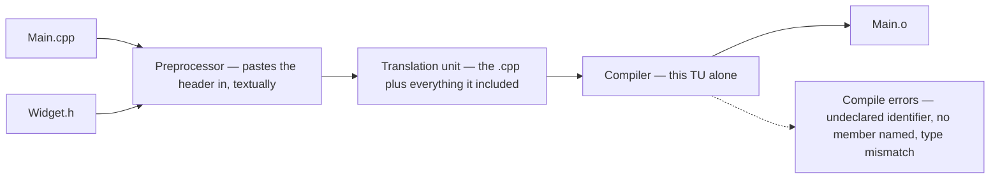
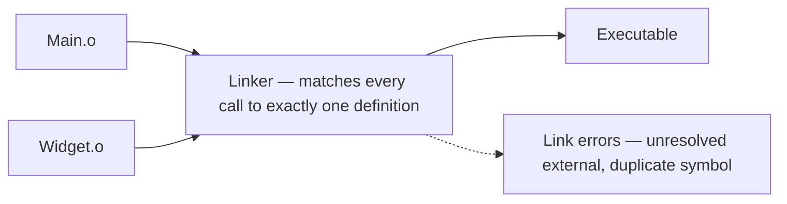

# Part IV — The Build and the Toolchain

---

## Chapter 12 — The Compilation Model

In C# the compiler sees the whole project at once and assemblies carry metadata. C++ compilation is a relic of the 1970s that you must understand, because half of all confusing C++ errors are build-model errors, not logic errors.

### The pipeline

1. **Preprocessor** — dumb text machine. `#include "Widget.h"` literally copy-pastes the file's contents into your source. (Quotes search next to the including file before the include path; `<string>` searches only the path — local headers in quotes, everything else in angle brackets.)
2. **Compiler** — compiles each .cpp file completely independently into an object file (.obj/.o). Each .cpp + everything it included = one **translation unit**. The compiler has no idea other .cpp files exist.
3. **Linker** — stitches all object files together, matching "I call function X" with "here's the body of X".

The pipeline in two pictures, because its two halves fail differently — and knowing which half you are looking at is the whole skill. Stages 1 and 2 run once per .cpp, in isolation. This is `Main.cpp`'s trip; `Widget.cpp` makes exactly the same one, and neither knows the other exists:



Stage 3 runs once for the whole program, and is the only place the translation units ever meet:



### Declarations, definitions, and why headers exist

```cpp
// Widget.h - declarations: WHAT exists
#pragma once
class Widget {
public:
    void Draw();       // declared, not defined
private:
    int size_ = 0;
};

// Widget.cpp - definitions: HOW it works
#include "Widget.h"
void Widget::Draw() { /* body */ }

// Main.cpp - a consumer
#include "Widget.h"    // now I know Widget's shape
int main() { Widget w; w.Draw(); }  // linker connects call to Widget.cpp's body
```

A thing can be *declared* many times but *defined* only once per translation unit — the **One Definition Rule (ODR)**. For non-inline functions and variables it is once across the whole *program*; classes, templates and inline functions may be defined in many translation units, provided every definition is identical. That exception is what makes headers work at all: `Widget`'s class definition is compiled into every .cpp that includes it.

### What goes in the header, and what goes in the .cpp

C# never asked: a type is one file, declaration and body inseparable, and `partial` exists for the day it is not. Here every entity has a place, and each row's mistake fails at a different stage — Chapter 23 provokes most of them:

| The thing | Where |
|---|---|
| a class definition — members, method *declarations* | the header: every translation unit that uses the type needs its layout |
| a member function body | the `.cpp`, as `void Widget::Draw() { ... }` — one definition per program, and a change recompiles one TU |
| a one-line accessor | in-class, in the header (implicitly `inline`) — unless the class crosses a binary boundary, where an inline body bakes a member offset into every caller and [Chapter 30](30-authoring-an-abi-boundary.md#chapter-30--authoring-an-abi-boundary) forbids it |
| a template, class or function | the header, body and all ([Chapter 7](07-templates-vs-csharp-generics.md#chapter-7--templates-vs-c-generics)); a `.tpp` or `.inl` included at the header's foot is the same thing with a longer name, and Chapter 27 prices what it costs every includer |
| a free function | declared in the header, defined once in a `.cpp`; defined in the header without `inline` it is Chapter 23's breakage 5, `multiple definition` / `duplicate symbol` |
| a constant, or a static data member | `inline constexpr` / `inline static` in the header (C++17) — the fix for [Chapter 4](04-classes-inheritance-interfaces.md#chapter-4--classes-inheritance-interfaces)'s separate definition in the `.cpp`, which still works; never `#define` |
| a helper nobody else calls | the `.cpp`, in an anonymous namespace: internal linkage, no header to keep in sync |

Two conventions ride on the table:

- **`.h` versus `.hpp`** is house style, not language — both are pasted the same way. The one real signal: `.h` is what a header shared with C looks like, `.hpp` says "C++ only". Match the codebase.
- **Include order** has one rule with a reason: a `.cpp` includes its own header *first*, then project headers, then third-party, then the standard library — so a header that forgot an include fails in its own `.cpp`, where its author is looking, rather than in some consumer's. Chapter 23's breakage 6 has the failure both ways. The one exception is a precompiled header: MSVC's `/Yu` ignores everything above the `#include "pch.h"` line, so where a project has one, it goes first and your own header second.

> [!TIP]
> **Key principle:** "A header carries declarations, templates and inline bodies; everything else is defined once in a .cpp — and a .cpp includes its own header first."

### Compile errors vs linker errors — read which stage failed

```text
error C2065: 'Widget': undeclared identifier
  -> COMPILE error: this translation unit never saw a declaration.
     Fix: missing #include.

error LNK2019: unresolved external symbol "void Widget::Draw(void)"
  -> LINKER error: compiled fine, but no object file contains Draw's body.
     Fix: .cpp not in project, library not linked, or declared-never-defined.
     (Also what you get putting a template's body in a .cpp.)
```

### Name mangling — why the symbol looks like that

The linker resolves *symbols*, and a C++ symbol is not your function's name. Overloading means `Draw(int)` and `Draw(double)` must link as different symbols, so the compiler encodes the whole signature into the name — `_ZN6Widget4DrawEv` in the Itanium world, `?Draw@Widget@@QEAAXXZ` from MSVC. That is **name mangling**, and it is why a raw linker error quotes something stranger than anything you wrote (`c++filt` decodes it, `undname` on Windows; Chapter 31 reads mangled frames in sanitizer stacks). Two consequences worth keeping: every compiler mangles its own way, one more reason binaries from different toolchains refuse to mix (Chapter 27); and `extern "C"` on a function switches mangling off — exported under its plain C name, findable by any language and any compiler, which is why every plug-in entry point in this book wears it (Chapter 8's `Plugin_Process`; Chapter 30 makes it a whole technique).

### Namespaces: the three you will write

C# has one kind of namespace and it does one job — organising names, with `using` to shorten them. C++ has three, and only the first is that job. The other two are answers to questions the compilation model above has just raised: what is private to *this file*, and what happens to a name when version two ships.

**Named — and the one thing it does that C#'s does not.** `namespace acme { ... }`, `acme::Widget`, `using namespace acme;`, and `namespace fs = std::filesystem;` for an alias. So far, C#. What C# has no counterpart for is **argument-dependent lookup**: an unqualified call also searches the namespaces of its *arguments'* types, so `swap(a, b)` finds the `swap` written beside the type rather than only the ones already in scope, and Recipe 25's JSON conversions are two free functions sitting beside `Reading` rather than anything registered anywhere. ADL is the mechanism behind most of the standard library's customization points, and the reason a helper written beside a type is found by code that never heard of it. It is also why *where* you put a function is a decision and not filing: move `to_json` into a namespace of your own and the library stops finding it, with an error naming neither.

**Unnamed — the file-private one.** A `namespace { ... }` with no name — the standard's word is *unnamed*, everyone says *anonymous* — gives everything inside it **internal linkage**: the name exists in this translation unit and in no other, so two `.cpp` files may each define `clamp_to_range` with different bodies and the linker is never asked to choose. That is where a helper nobody else calls belongs — the row the table above gave it — and it is the closest thing C++ has to `internal`, except that the unit is the file rather than the assembly. `static` at namespace scope says the same thing and is the older spelling you will read in C code; the unnamed namespace is preferred because it works for types too, which `static` cannot do. Recipe 50 in [Appendix F](F-rosetta-cookbook.md#appendix-f--the-rosetta-cookbook) is the shape, shown across the two files the claim takes. The one thing that breaks it is a **unity build** ([Appendix J](J-cmake-catalogue.md#appendix-j--the-cmake-catalogue)), which concatenates translation units before compiling them: the two files become one, and two file-private names that never met now collide.

**Inline — the version in the symbol.** This one exists for exactly the problem [Chapter 30](30-authoring-an-abi-boundary.md#chapter-30--authoring-an-abi-boundary) is about. Mark a nested namespace `inline` and its members are reachable *as if* they were in the parent — `audio::frame_size()` means `audio::v2::frame_size()` — while the mangled symbol still carries the version:

```cpp
--8<-- "exercises/cookbook/namespaces.cpp:inline-namespace"
```

Compile that and ask the object file what it holds: two symbols, `audio::v1::frame_size()` and `audio::v2::frame_size()`, and no `audio::frame_size()` at all. Source code that says `audio::frame_size` compiles against whichever is inline today; a *binary* linked last year against v1 goes on calling v1, because the name it recorded was never the short one. Both versions ship in the same library and neither breaks the other — which is the trick, and it is invisible from the call site. You will meet it before you write it: libstdc++'s `std::__cxx11` is how one library shipped two incompatible `std::string` layouts through the C++11 change, and it is why a linker error sometimes quotes a type nobody wrote.

> [!WARNING]
> **Trap:** `using namespace` at file scope in a header. Every file that includes it inherits every name in that namespace, at any depth of the include graph, and the ambiguity it eventually causes surfaces in somebody else's translation unit with no clue pointing back at your header.

**And the question this raises that has a "no" for an answer.** If an inline namespace can decide which of two implementations a name reaches, can a namespace be a **feature toggle** — flip which one is inline and ship both? No, and the reason is worth holding, because the shape is genuinely tempting. A namespace is resolved when the code is *compiled*; a feature flag is a value read when the program *runs* (Recipe 31). The two cannot meet: choosing per-installation, per-customer or per-session is a runtime decision, and no amount of namespace machinery moves a runtime value backwards into the compiler. What you would actually get is a build-time *variant* — two binaries to build, test, ship and support, which is [Chapter 26](26-build-systems-and-cmake.md#chapter-26--build-systems-and-cmake)'s compile definition wearing better clothes, and that chapter's own advice is to keep those to the one case that earns them: a switch that changes a type's layout. Where the flag really is a runtime value, the answer is the boring one — a member on a struct read once at startup, tested with an `if`, or two implementations behind one interface with the flag choosing between them. Both are compiled, both ship, and both can be tested in one binary, which is the property the namespace version quietly gives up.

### Include guards

Since #include is paste, a header included twice via diamond paths would define the class twice in one translation unit. Every header, always:

```cpp
#pragma once        // modern

#ifndef WIDGET_H    // classic portable form
#define WIDGET_H
...
#endif
```

### The preprocessor, and the four ways a macro lies

Stage 1 of the pipeline is a text machine, and it is worth one section of its own because C# gave you a fraction of it. There, `#if DEBUG` and `#define TRACE` exist, the symbols have no values, and nothing substitutes into your source. Here the preprocessor runs *before the compiler sees anything* — before types, before scopes, before namespaces — and rewrites your file. That is its power and all four of its hazards.

**Reach for it when nothing else can do the job**, which is a shorter list than the amount of macro code in the wild suggests: conditional compilation on a platform, a toolchain or a standard (`#ifdef _WIN32`, and the feature-test macros of [Appendix K](K-the-standards-catalogue.md#appendix-k--the-standards-catalogue)); include guards; quoting source text as a string, which no C++ feature can do; and stamping a call site with `__FILE__` and `__LINE__`, which nothing could do until C++20's `std::source_location`. Those last two are why [Chapter 28](28-testing.md#chapter-28--testing)'s test framework is macros and not functions. For everything else there is a better tool now: `constexpr` for a constant (the table above), `inline` for a small function, a template for a family of them, `enum class` for a set of names.

Everything below compiles clean under `-Wall -Wextra`, runs, and answers wrong — which is the reason to know all four cold rather than two.

**1. It substitutes text, so precedence is not yours.**

```cpp
--8<-- "exercises/cookbook/macros.cpp:macro-parens"
```

`SQUARE_BAD(1 + 2)` expands to `1 + 2 * 1 + 2`, which is **5**. No function could be wrong this way. Hence the rule: every parameter in parentheses, and the whole body in parentheses too.

**2. It substitutes text *again*, so arguments are evaluated as many times as they appear.**

```cpp
--8<-- "exercises/cookbook/macros.cpp:macro-double-eval"
```

`MAX_BAD(next(), 0)` calls `next()` twice — once in the comparison, once in the result — and returns the *second* call's value. The parentheses of rule 1 do nothing about this, and no amount of care in the macro can fix it; only not being a macro can. `std::max` is a function for exactly this reason.

**3. It has no idea what a statement is.**

```cpp
--8<-- "exercises/cookbook/macros.cpp:macro-do-while"
```

`if (cond) BUMP_TWICE_BAD(n);` gives the `if` the first increment and runs the second unconditionally. The `do { ... } while (0)` wrapper is not a superstition: it makes a multi-statement macro one statement that still takes a trailing semicolon, and it is why you will see that shape in every codebase that has been bitten.

**4. It has no scope, no namespace and no type.** A macro is not in a namespace, cannot be qualified, and rewrites every matching token in every file that comes after it, at any include depth. This is why macros are `SCREAMING_CASE` and nothing else is ([Appendix A.8](A-fundamentals-refresher.md#appendix-a--fundamentals-refresher)) — the convention is the only collision protection there is. The canonical casualty: `<windows.h>` defines `min` and `max` as macros, so a header that includes it breaks `std::max(a, b)` in every file downstream, with an error pointing at the standard library. The fix is to define `NOMINMAX` before the include, and the reason you have to know that is rule 4.

The one thing on the list that is a *capability* rather than a hazard is the stringifier, because it is the reason the preprocessor cannot simply be retired:

```cpp
--8<-- "exercises/cookbook/macros.cpp:macro-stringify"
```

`#expr` turns the argument's source text into a string literal — `NAME_OF(a + b)` is `"a + b"` — and `##` pastes two tokens into one identifier. Nothing in the language proper can see its own source text, which is why `CHECK(x == y)` can print `x == y` and a function taking a `bool` never could.

> [!TIP]
> **Key principle:** "A macro is a text substitution with no scope and no type, so I reach for one only where nothing else can do the job — conditional compilation, include guards, quoting source text, stamping a call site — and I write every parameter in parentheses and every multi-statement body in a do/while(0)."

### Forward declarations — the build-time optimization

```cpp
// Renderer.h
class Widget;                       // forward declaration - "it exists"
class Renderer {
public:
    void Render(const Widget& w);   // fine - refs/pointers don't need size
private:
    Widget* current_;               // fine
    // Widget value_;               // NOT fine - needs full definition
};

// Renderer.cpp
#include "Widget.h"                 // full include belongs here
```

Why bother: **build times** — including Widget.h means every file including Renderer.h recompiles whenever Widget.h changes; in a CAD-sized codebase header hygiene is the difference between 5-minute and 2-hour builds. And **circular dependencies** — forward declarations break A-needs-B-needs-A deadlocks. Rule: include as little as possible in headers, forward-declare where you can, include fully in .cpp files.

### Modules, 30 seconds

C++20 **modules** (import instead of #include) fix this whole mess — but adoption is slow and virtually every SDK ecosystem is headers all the way. Know they exist; expect to live in headers.

### What is a .lib file? (see Appendix A for full detail)

A **static library**: an archive of .obj files. The linker copies needed code into your binary. On Windows, DLLs also ship a tiny companion .lib — an **import library** of stubs telling the linker "function X lives in Foo.dll". Same extension, two different animals.

### In the wild: C-style SDKs

A plug-in is a DLL/bundle loaded by a host application; a device application links a vendor's driver library. Either way the trio applies: you compile against the SDK's headers, link against its .lib/.a files, and the host or driver exports the functions you call at runtime. Miss the header = compile error; miss the .lib = LNK2019; wrong SDK/runtime version = plug-in won't load or device won't open. Binary compatibility across DLL boundaries is a real C++ concern, and a harsher one than its C# equivalent. You have met the C# version — an assembly compiled against one version of a library meeting another at runtime, and answering with `MissingMethodException`. What you have never met is a *compiler* ABI mismatch: two components built with different compilers, settings or runtimes that cannot safely exchange C++ types at all, whatever their versions say. IL has one runtime-defined ABI; C++ has none.
