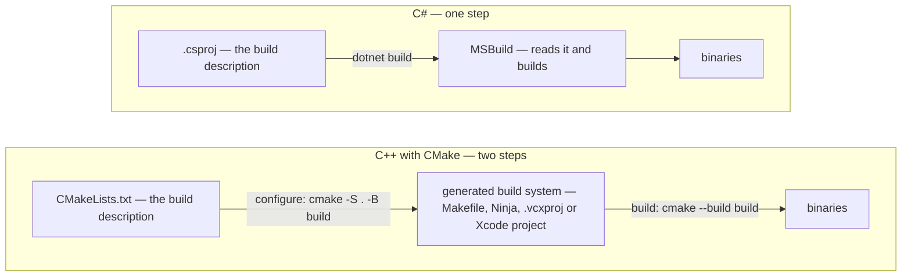

# Part VI — The Real Codebase

The exercises are deliberately small: one file, one command, one thing to learn. A real project is none of those things, and the difference is not more C++ — it is everything *around* the C++. This part covers what a codebase has that an exercise does not, starting with the one you meet on day one: something other than you deciding how the compiler gets called.

---

## Chapter 26 — Build Systems and CMake

Every command in this book so far has been the same shape: hand the compiler a file, get a program. `clang++ -std=c++17 -Wall -Wextra main.cpp -o app` works perfectly — to exactly the size of an exercise. A real project is two hundred source files, three configurations, two platforms, and six libraries, and nobody types that command.

In C# you never met this problem, because you never met it *consciously*. `dotnet build` reads the .csproj; the .csproj is a dozen lines because MSBuild already knows what a C# project looks like — compile everything under the folder, target this framework, restore these packages. The conventions are the product. C++ has no conventions: no standard project layout, no standard package format, no agreement on where headers live. So the build description carries everything, and someone has to write it. That someone is increasingly you.

### What a build system is actually for

Four jobs. Which sources are in the build; which flags each one gets; what links against what, in what order; and — the one that earns the tool its keep — **what needs rebuilding when a file changes**.

That last job is Chapter 23's seventh breakage, solved. Recall it: edit a header, rebuild only one translation unit, link, and get an ODR violation that no tool reports because the object files disagree about a class's layout and the linker cannot tell. That is not an exotic failure. It is what happens *by default* whenever a build forgets that main.cpp depends on Greeter.h. A build system's central promise is that it never forgets — it scans your `#include`s, records the graph, and rebuilds everything downstream of a touched header:

```text
$ touch Greeter.h
$ cmake --build build
[ 25%] Building CXX object CMakeFiles/greeter.dir/Greeter.cpp.o
[ 75%] Building CXX object CMakeFiles/greet.dir/main.cpp.o    <- main.cpp too
```

`main.cpp` was not edited. It was rebuilt because it includes the header that was. This is the whole reason "clean build fixes it" stops being folklore: with dependencies tracked correctly, you should almost never need one.

### CMake is a generator — get this one idea straight first

Here is the thing that confuses every arrival from the managed world, and it is worth thirty seconds of deliberate attention.

MSBuild *is* the build system. The .csproj goes in, binaries come out, one tool, one step.

CMake is not that. **CMake does not build your code. It reads `CMakeLists.txt` and writes a build system** — a Makefile, a Ninja file, a Visual Studio solution, an Xcode project — and *that* generated thing builds your code. Always two steps: **configure**, then **build**.

| C# | C++ with CMake |
|---|---|
| `.csproj` — the build description | `CMakeLists.txt` — the build description |
| MSBuild — reads it and builds | the *generated* Makefile / Ninja / .vcxproj — builds |
| — | CMake — reads the description and *writes* the above |
| `dotnet build` | `cmake -S . -B build` then `cmake --build build` |

The same contrast as a picture — one arrow on the C# side, an extra box on ours:



Why tolerate the indirection? Because it is what lets one build description serve every platform: the same CMakeLists gives a Linux developer a Ninja build, a Mac developer an Xcode project, and a Windows developer a .sln they open in Visual Studio and debug normally. A cross-platform SDK ships one build description, and its Windows users never know.

### Your first CMakeLists.txt

Use the Greeter trio from Chapter 23 — `Greeter.h`, `Greeter.cpp`, `main.cpp`, already on your disk in `exercises/buildlab/`. Put this next to them:

```cmake
cmake_minimum_required(VERSION 3.16)

project(greeter LANGUAGES CXX)

# The standard IS abstracted by CMake - it knows each compiler's spelling
# (-std=c++17 vs /std:c++17), so you state the intent once.
set(CMAKE_CXX_STANDARD 17)
set(CMAKE_CXX_STANDARD_REQUIRED ON)   # fail loudly rather than silently downgrade
set(CMAKE_CXX_EXTENSIONS OFF)         # plain C++17, not the compiler's dialect of it

# Sources are LISTED, never globbed - see the pitfalls below.
add_executable(greet main.cpp Greeter.cpp)
```

Then the two commands:

```bash
cmake -S . -B build      # configure: generate a build system into build/
cmake --build build      # build: run whatever was generated
./build/greet
```

`-S` is the source directory (where CMakeLists.txt lives), `-B` the build directory. Everything CMake produces goes in `build/`, nothing goes next to your source, and `build/` belongs in .gitignore. That separation is called an **out-of-source build**, and deleting `build/` is the real, total "clean" — the one that actually works.

### Targets are the unit, and flags belong to targets

The above is honest but small. Real projects are built from **targets** — libraries and executables — and modern CMake attaches every requirement to the target that has it, rather than setting global flags and hoping.

```cmake
# The library: the code worth reusing, testing, and shipping.
add_library(greeter Greeter.cpp)

# PUBLIC: anything linking greeter also needs this on its include path,
# because Greeter.h is part of the library's *interface*.
target_include_directories(greeter PUBLIC ${CMAKE_CURRENT_SOURCE_DIR})

# PRIVATE: these compile the library itself and stop there - consumers have
# their own opinion about warnings and shouldn't inherit mine.
if(MSVC)
    target_compile_options(greeter PRIVATE /W4)
else()
    target_compile_options(greeter PRIVATE -Wall -Wextra)
endif()

add_executable(greet main.cpp)
target_link_libraries(greet PRIVATE greeter)   # include dirs arrive automatically
```

`greet` never mentions `Greeter.h`'s location. It links `greeter`, and the PUBLIC include directory travels with it. That propagation is the whole idea, and it has a C# analogue you already know: a `ProjectReference` gives you the referenced project's public surface transitively, without you restating it. **PRIVATE** = I need this to build. **PUBLIC** = I need it, and so does anyone who uses me. **INTERFACE** = I don't need it, but my consumers do (the header-only-library case).

Notice also what the `if(MSVC)` is telling you: CMake abstracts the *build*, not the compiler's flag vocabulary. Standards, optimization levels, and debug info are abstracted; warning flags and sanitizer flags are not — you write both dialects yourself.

### Build types, and wiring in the handbook's flags

C++ builds come in configurations, and Chapter 13's warning applies with force: UB hides in Debug and detonates in Release.

```bash
cmake -S . -B build -DCMAKE_BUILD_TYPE=Debug     # -g, no optimization
cmake -S . -B build -DCMAKE_BUILD_TYPE=Release   # -O2/-O3, NDEBUG defined
```

To get this book's canonical sanitizer build as a switch rather than a memory:

```cmake
option(GREETER_SANITIZE "Build with Address and UB sanitizers" OFF)

if(GREETER_SANITIZE)
    if(MSVC)
        # MSVC ships ASan only - there is no /fsanitize=undefined - and its
        # linker pulls in the runtime by itself, so no link options here.
        target_compile_options(greeter PUBLIC /fsanitize=address)
    else()
        # PUBLIC so the flags reach every target that links this one: only the
        # code compiled with them is checked.
        target_compile_options(greeter PUBLIC -fsanitize=address,undefined -g)
        target_link_options(greeter PUBLIC -fsanitize=address,undefined)
    endif()
endif()
```

```bash
cmake -S . -B build -DCMAKE_BUILD_TYPE=Debug -DGREETER_SANITIZE=ON
cmake --build build && ./build/greet
```

> [!WARNING]
> **Trap:** sanitizers must be passed to **both** the compiler and the linker. Drop the `target_link_options` line and the compile succeeds, then the link collapses into a wall of undefined symbols: `"___asan_init", referenced from: _asan.module_ctor in main.cpp.o`. Read it with Chapter 12's cause list in hand and it decodes immediately — unresolved external means *a definition is missing at link time*, and the missing definitions here are the sanitizer's runtime library. The flag is how you link that library; passing it only to the compiler instruments the code and never brings the runtime along. It is the same diagnosis as a forgotten SDK .lib, wearing different symbol names. MSVC teaches the same lesson one stage later: its linker brings the ASan runtime in for you, so the build is clean and the program then refuses to start, because `clang_rt.asan_dynamic-x86_64.dll` ships next to `cl.exe` rather than in a directory Windows searches — run it from a developer command prompt, or put that directory on `PATH`. Instrumented, linked, and still not runnable is a third stage worth having a name for.

Note how far that PUBLIC actually reaches: to the targets that link `greeter` — and onward from there, through any consumer that itself links `greeter` PUBLIC or INTERFACE, stopping only where one links it PRIVATE. Here that chain is one hop, because the only consumer is an executable. Add a second library that never links `greeter`, and it compiles uninstrumented — no error, no warning; the code you forgot is simply never checked. Mixing instrumented and uninstrumented objects is legal, which is exactly what makes it dangerous: the build stays green and the coverage quietly shrinks. Past two or three targets, give the flags a target of their own — the INTERFACE case from the previous section, a library that compiles nothing and carries requirements:

```cmake
add_library(sanitizers INTERFACE)   # no sources; the flags ARE the target

if(GREETER_SANITIZE AND NOT MSVC)   # (the MSVC branch moves across unchanged)
    target_compile_options(sanitizers INTERFACE -fsanitize=address,undefined -g)
    target_link_options(sanitizers INTERFACE -fsanitize=address,undefined)
endif()

target_link_libraries(greeter PUBLIC sanitizers)   # and every other target too
```

One place to change when the flag list grows, and a checklist you can read: any target not linking `sanitizers` is a target nobody is checking.

### Compile-time switches, and the one that must be global

C# has `#if DEBUG`, `[Conditional("DEBUG")]`, `DefineConstants` in the csproj, and a feature-flag library reading configuration at run time. C++ has the same four tools, plus a hazard C# cannot express: a preprocessor switch can change the *layout* of a type, and a type's layout is baked into every translation unit that saw the header. In order of preference:

1. **A runtime flag.** A `bool` read from configuration *once, at startup*, into a member, and tested with `if` — a branch, which is free even on [Chapter 36](36-the-host-stutters.md#chapter-36--the-host-stutters)'s deadline thread, where a lookup per call is not a flag but a crime. For anything that changes behavior and not types it is the best tool, because no build is involved at all; reaching for the preprocessor first is a habit from before configuration files. Recipe 31 in [Appendix F](F-rosetta-cookbook.md#appendix-f--the-rosetta-cookbook) is the shape — a struct of defaults filled once at startup.
2. **`if constexpr` on a constant.** `inline constexpr bool kAuditing = true;` in a header, and `if constexpr (kAuditing) { ... }` where it matters. The compiler discards the dead branch but — outside a template — *parses* both, so a typo in the disabled half still fails the build, the thing `#ifdef` never gives you; and no type's layout can depend on it.
3. **A compile definition with `#ifdef`.** For what genuinely must not compile at all: a platform-specific file, an SDK version guard (`#if SDK_VERSION >= 29`, which Appendix D warns you to expect), a debug-only diagnostic. CMake spells it `target_compile_definitions(greeter PUBLIC GREETER_AUDIT=1)` — the csproj's `DefineConstants` line — and the visibility keyword decides which translation units see it.
4. **`NDEBUG`**, the switch the language ships ([Appendix E](E-glossary.md#appendix-e--glossary)'s `assert / NDEBUG` entry) — and Recipe 24 in [Appendix F](F-rosetta-cookbook.md#appendix-f--the-rosetta-cookbook) is what it costs when a side effect lives inside the assert.

The rule is about tool 3, and it is Chapter 27's diamond with a macro for a cause:

```cpp
// session.h
#pragma once
struct Session {
    int id;
#ifdef AUDIT
    int audit_count;     // present only where AUDIT is defined
#endif
    int timeout;
};
inline int GetTimeout(const Session& s) { return s.timeout; }
```

Compile one translation unit with `-DAUDIT` and one without, and there are two `Session`s in the program — eight bytes and twelve — and two `GetTimeout`s reading `timeout` at different offsets, both `inline`, so the linker keeps one, says nothing, and link order decides which: [Chapter 27](27-dependency-management.md#chapter-27--dependency-management)'s diamond, arriving through a define rather than a dependency, and that chapter has the mechanism in full. On this machine at `-O0`, `main` reads 30 in one link order and 0 in the other. What is worse than the diamond is what the sanitizers say, which is nothing: in this program the object is built in the larger translation unit, so every read lands inside it, and both orders exit 0 under the canonical flags. Build it in the smaller one instead and the larger layout's reader overreads — the same asymmetry Chapter 27 shows, and in a real program which direction you get is luck. `check_platform_claims.sh` holds the silent link, the disagreement, and this program's silence on both CI platforms.

So: a definition that changes a class's layout is `PUBLIC` on the target that owns the class, so every consumer compiles the same struct — and it never appears in a public header of a shipped library at all, which is [Chapter 30](30-authoring-an-abi-boundary.md#chapter-30--authoring-an-abi-boundary)'s one rule from the preprocessor's side. `exercises/buildlab/` carries the discipline in miniature: `GREETER_AUDIT` is an `option()` wired through `target_compile_definitions(... PUBLIC ...)`, `Greeter.h` gains a member behind it, and `build_all.sh` reads the compile database back to confirm the define reached `main.cpp` as well as `Greeter.cpp` — the executable's translation unit sees the same `Greeter` the library's does — and reached neither by default. A define that only changed behavior inside `Greeter.cpp` would be `PRIVATE`, by Chapter 26's own rule; it is the member that makes it PUBLIC.

> [!TIP]
> **Key principle:** "I put a define that changes a type's layout PUBLIC on the type's own target and never in a shipped header — two layouts of one struct is an ODR violation the sanitizers see only by luck."

### In the wild: vendor SDKs and IDE-native projects

A well-maintained SDK ships CMake support, and consuming it is two lines:

```cmake
find_package(VendorSDK REQUIRED)                       # locates it, defines targets
target_link_libraries(greet PRIVATE VendorSDK::Core)   # headers + libs + defines
```

That imported target carries its own include directories, its libraries, and any required compile definitions — the first two of the Chapter 12 trio (headers for the compiler, .lib for the linker) handled in one line. The third, the runtime reaching the loader, is still yours: CMake copies no vendor DLL next to your binary by default, and the sanitizer-runtime warning earlier in this section is exactly that stage failing — PATH, an explicit copy step, or RPATH closes it.

Plenty of SDKs ship no such thing. Then you locate the pieces by hand — `find_path` for headers, `find_library` for the binary — and wrap them in an imported target yourself so the rest of your build stays clean. Do that once, in one file, rather than scattering include paths through the project. [Chapter 40](40-cmake-for-the-plug-in.md#chapter-40--cmake-for-the-plug-in) is that file, and the plug-in build around it.

And the honest note: a great many native SDK shops never use CMake at all. They keep a checked-in Visual Studio solution or Xcode project, because the SDK's own samples ship that way and the team edits build settings in a properties dialog. That is a legitimate, extremely common setup — and the compilation model underneath it is identical, which is why Chapter 12 is the chapter that matters and this one is the tooling on top. If you land in such a team, read their project's settings the way you would read a CMakeLists: which sources, which flags, which libraries, which configurations.

### A layout that survives

This chapter opened by saying C++ has no standard layout. What it has is a convention most projects converge on, and one the tools reward:

```text
myplugin/
  CMakeLists.txt        one per directory; the root one adds the others
  include/myplugin/     public headers - the ABI surface (Chapter 30) - included as <myplugin/x.h>
  src/                  .cpp files and private headers; nothing here is a promise
  tests/                a second executable, run by CTest (Chapter 28)
  third_party/          vendored dependencies, each with a README naming its version (Chapter 27)
  cmake/                find-modules, and the hand-written imported target for an SDK that ships no config
  build/                generated and gitignored - the only directory `rm -rf` should ever touch
```

Each line's chapter is where its reasoning lives; what is stated nowhere else is the project-name subdirectory, which makes every include spell `<myplugin/session.h>` and so cannot collide with a vendor's `session.h`. The SDK is not in the tree on purpose: it is the dependency you do not control, located at configure time. The `include/<name>/` plus `src/` core is what `exercises/deplab/mathlib/` uses, built by CI; the tree above is the one to copy on day one, and the nearest written convention, the "pitchfork" layout, is this tree with `third_party/` spelled `external/` and more rooms.

The tree above is the directories. A project that survives also has a handful of files at its root, each read by a tool rather than a person, and a C# developer arriving from a `.sln` will not know which are load-bearing:

```text
myplugin/
  CMakeLists.txt        the root build description (above)
  CMakePresets.json     named configurations - Chapter 40's dev preset, the solution file you never write
  .clang-format         whitespace, enforced by a tool - the .editorconfig you know (Appendix A.8)
  .clang-tidy           the analyzers and their severities - reserved identifiers, naming, the bugprone-* family
  .gitignore            build/ and every generated directory - the bin/ and obj/ you already ignored
  README.md             configure, build, test - the three commands a stranger types first
  LICENSE               the terms, one file, unmodified
  NOTICE                only if third_party/ carries anyone else's code: whose, and under what
```

Two rules ride on the tree that no file states, and both are habits you already have — one type per file is C#'s, and a namespace that follows the folder is what Visual Studio writes into every new file — with one difference that makes them rules here rather than defaults: the C# compiler finds a type wherever its file sits, and a C++ `#include` path is spelled by hand, so a name that means three things in the path, the namespace and the file costs a search every time. **The namespace mirrors the directory** — Boost's and Google's habit, not a standard's: when the tree grows a `wire/` for the parser of [Chapter 34](34-parse-this-capture.md#chapter-34--parse-this-capture), the code under `include/myplugin/wire/` lives in `namespace myplugin::wire`, so an identifier's home is readable off its qualified name and a `#include` path and a `using` never disagree about what a thing is called. And **one class, one header pair:** `Session` is declared in `session.h` and defined in `session.cpp`, named for the type — spelled however the codebase spells its files (Appendix A.8; this book's labs use `Greeter.h`, deplab uses `mathlib.h`) — so a reader who meets the type in a review can open its file without a search. Private headers — the ones nothing outside `src/` may include — stay in `src/` beside the `.cpp` that owns them, and never gain the project-name prefix: `<myplugin/...>` is the ABI surface of the tree above, and everything [Chapter 30](30-authoring-an-abi-boundary.md#chapter-30--authoring-an-abi-boundary) says about a boundary being a promise applies to it and to nothing in `src/`. Tests sit apart in `tests/`, named for what they test (`session_test.cpp`): a test binary is a second executable with its own `main`, so it can never be a source of the first one ([Chapter 28](28-testing.md#chapter-28--testing)), and a directory of its own keeps the two source lists from being confused by the person, since CMake will not confuse them. Both rules cost nothing on day one and a rename on day ninety; the tree, the root files and the two rules together are what to copy — stated here, and checked by nothing in this repository, which carries a preset but no `.clang-format` of its own.

### Pitfalls

- **Globbing sources.** `file(GLOB SOURCES *.cpp)` looks like a labour-saver and is a trap: CMake evaluates it at *configure* time, so a newly added file is invisible until someone re-configures — and the failure lands on whoever pulls your commit, as an unresolved external. `CONFIGURE_DEPENDS` (CMake 3.12+) buys the correctness back by re-globbing on every build, at the price of a directory scan every build — and CMake's own documentation declines to promise it works on every generator, which is a strong hint about how much weight to put on it. List your sources. The diff noise is the point: adding a file to the build should be a visible act.
- **A stale cache.** `build/CMakeCache.txt` remembers your configure-time choices, including the compiler. Changing toolchain or fighting an inexplicable configure result: delete the build directory, don't debug the cache.
- **`CMAKE_BUILD_TYPE` on a multi-config generator.** Visual Studio and Xcode hold all configurations at once and ignore it entirely; there you pass `--config Debug` at *build* time instead. Setting it and seeing no effect is not a bug.
- **Mixing configurations on Windows.** Debug and Release use different C runtimes (`/MDd` vs `/MD`). A plug-in built Debug against a Release host — or against Release SDK libraries — produces link errors, or loads and corrupts memory in ways that look like your bug. Match the host's configuration; this is one of the highest-value entries your notes file will ever hold.
- **Assuming the generated build is the source of truth.** Never edit files inside `build/`. They are output. The next configure overwrites them.

> [!TIP]
> **Key principle:** "CMake doesn't build my code — it generates the thing that builds my code. Configure, then build: two steps, always."

> [!TIP]
> **Key principle:** "Requirements belong to targets, not to the whole project — PRIVATE for what I need, PUBLIC for what my consumers need too."

> [!TIP]
> **Key principle:** "I list source files, never glob them — a file joining the build should be visible in the diff."

### Try it

Write the CMakeLists for the Greeter trio from scratch — file listed, then library-plus-executable — and get `./build/greet` running. A finished one now sits in `exercises/buildlab/` — the shape this chapter ends on, built and run by the repository's own CI so it cannot quietly rot; write yours in a directory of its own and read that one afterwards. Then earn the chapter:

1. **Prove the dependency graph.** `touch Greeter.h`, rebuild, and confirm `main.cpp` recompiles. Then break the graph deliberately: edit the header's class definition, rebuild *only* the library target (`cmake --build build --target greeter`), link by hand, and reproduce Chapter 23's breakage 7. Now you have seen both sides of the promise.
2. **Prove the sanitizer switch.** Configure with `-DGREETER_SANITIZE=ON`, add a deliberate heap overflow to main.cpp, and confirm ASan reports it — the report should name `main.cpp` and the line. Then comment out `target_link_options`, rebuild, and read the resulting link failure until the `___asan_init` symbols make sense. Predict the *stage* before you run it: this is Chapter 23's error-stage triage on a real, non-obvious case.
3. **Generate a native project.** With the full IDE installed, `cmake -S . -B build-ide -G Xcode` (or `-G "Visual Studio 17 2022"`), then open the result and build from the IDE. Same CMakeLists, same code, a project file you never wrote — the payoff for the two-step model. `cmake --help` lists the generators your installation actually offers, which is the honest way to find out what is available on your machine.
4. **Split it.** Move Greeter into a `src/` subdirectory with its own CMakeLists and pull it in with `add_subdirectory`. That is the shape every real project has — the tree in *A layout that survives* — and doing it once removes the mystery. Put the root files in place too: a `.gitignore` with `build/`, and a `CMakePresets.json` naming the configure line you have been typing (Chapter 40's shape); afterwards `git status` should show nothing generated.
5. **Prove a define's reach.** Configure with `-DGREETER_AUDIT=ON`, open `build/compile_commands.json`, and find `-DGREETER_AUDIT=1` on *both* `Greeter.cpp` and `main.cpp` — then change the `PUBLIC` to `PRIVATE`, reconfigure, and watch it vanish from `main.cpp` while the build stays green. Now give `Greeter` a member behind `#ifdef GREETER_AUDIT`, keep the `PRIVATE`, and run it in a build without the sanitizers: the two translation units disagree about `sizeof(Greeter)`, nothing reports it, and you have built the compile-time-switches section's diamond with your own hands. Then rebuild with `GREETER_SANITIZE=ON` and watch AddressSanitizer report a `stack-buffer-overflow` in `Greeter::Greeter` — the constructor *writes* the member into an object `main.cpp` allocated without it, which is the one shape of this bug the sanitizers can see, and Chapter 30's `Naive` break arriving through a define. The section's `session.h` only reads, and stays silent.

---


<!-- nav:begin -->
[← Chapter 25 — Findings from Practice: a Living Log](25-findings-from-practice.md) · [Contents](README.md) · [Chapter 27 — Dependency Management →](27-dependency-management.md)
<!-- nav:end -->
