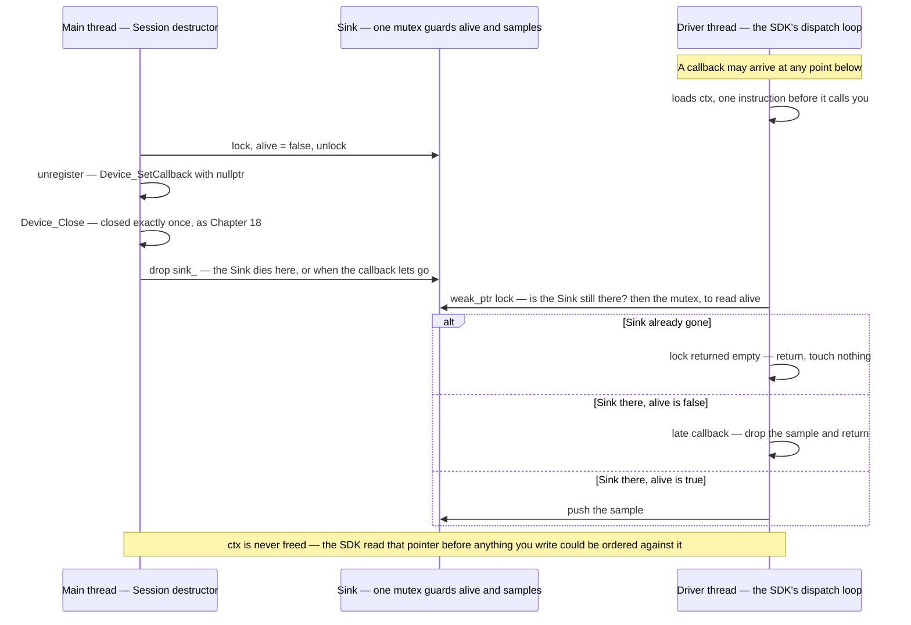

## Chapter 29 — Concurrency

This book has been deferring this chapter on purpose, and twice made a promise it did not keep. Chapter 16 taught you to ask every SDK *what thread calls me back?* — one of the four questions to answer before calling anything. Chapter 18 supplied the answer for when the documentation is silent, "a thread that isn't yours", built the trampoline, and stated that a driver thread adds two requirements the exercise deliberately excluded: synchronization around everything the callback touches, and unregister-then-join semantics in the destructor. Then it left you there.

Time to pay up. The vocabulary first, then the thing the book kept pointing at.

### The model you are leaving behind

C# hands you a complete concurrency runtime. A thread pool sized for you, `Task` as the unit of work, `async`/`await` as a compiler transformation that turns your method into a state machine so a waiting operation costs no thread at all, a synchronization context that puts continuations back on the UI thread, and `CancellationToken` threaded through it all. You express *what* should happen; the runtime decides *where*.

C++ has no runtime. `std::thread` is an operating-system thread — a real one, created eagerly, with its own stack — a megabyte on Windows, 512 KB for a secondary thread on macOS, 8 MB reserved with glibc on Linux (Chapter 3), which is why "just spawn one per work item" is a design error here and merely wasteful there. There is no pool unless you write one or take one from a library. There is no `await`; C++20 coroutines exist but need a library on top to be usable, and you are unlikely to meet them in SDK work. The standard library gives you primitives, and the composition is yours.

| C# | C++ |
|---|---|
| `Task.Run(...)` | `std::thread` (an OS thread) or `std::async` |
| `await task` | `future.get()` / `thread.join()` — **blocking**, not suspending |
| `lock (obj) { }` | `std::lock_guard` / `std::scoped_lock` over a `std::mutex` |
| `Interlocked.Increment` | `std::atomic<int>::fetch_add` |
| `ManualResetEvent` / `Monitor.Wait` | `std::condition_variable` |
| `Task<T>` result | `std::future<T>` |
| `CancellationToken` | `std::stop_token` (C++20 `jthread`), or your own `atomic<bool>` |
| `ConcurrentDictionary<K,V>` | nothing — a `std::map` plus a mutex you write |

That last row is worth pausing on. The standard library has no concurrent containers at all. A shared map is a plain map with a mutex around every access, designed by you.

### std::thread has an obligation, and it is not RAII

Every thread must be **joined** (wait for it) or **detached** (abandon it) before its `std::thread` object is destroyed. Fail, and the destructor calls `std::terminate` — the program aborts, immediately, with no exception to catch:

```cpp
{ std::thread t([]{ }); }        // neither joined nor detached
// libc++abi: terminating          -> exit code 134
```

That is startling coming from C#, where an abandoned `Task` is simply collected. It is also, unusually for this book, a place where the standard library is *not* RAII: `std::thread`'s destructor does not do the sensible thing, because the committee could not agree whether the sensible thing was to join or to detach.

C++20 fixed it with `std::jthread`, which joins in its destructor and carries a `stop_token` for cooperative cancellation:

```cpp
{ std::jthread t([]{ }); }       // joins automatically; prints "after", exits 0
```

> [!TIP]
> **Key principle:** "Every std::thread must be joined or detached before it dies, or the program terminates — I use jthread where C++20 is available, and treat a bare std::thread as a resource needing an owner."

### The data race, and why you cannot test for one

Here is the single most important thing in this chapter, and it is not what most people expect.

In C#, an unsynchronized `++counter` from several threads gives you a *wrong count*. Lost updates, a number smaller than it should be — a value problem, in a program that otherwise behaves. The CLR's memory model guarantees you will at least read some coherent value.

C++ makes an unsynchronized access from two threads, where one writes, **undefined behavior** — the same category as a use-after-free (Chapter 3). Not "a wrong number": no defined behavior at all. And here is what that looks like in practice. Four threads, one hundred thousand increments each, no synchronization:

```cpp
int counter = 0;                       // file scope: shared, unsynchronized

std::vector<std::thread> ts;
for (int i = 0; i < 4; ++i)
    ts.emplace_back([]{ for (int j = 0; j < 100000; ++j) ++counter; });
for (auto& t : ts) t.join();
```

Built at `-O2` and run three times:

```text
counter = 400000  (expected 400000)
counter = 400000  (expected 400000)
counter = 400000  (expected 400000)
```

That transcript is clang at `-O2` on this book's macOS/arm64 machine, and whether *your* compiler collapses *this* loop is neither promised nor the point — the point is that a compiler may, and that nothing in the output tells you when it did.

The right answer, every time. The optimizer collapsed each thread's loop into a single addition, the windows for interleaving all but vanished, and a textbook data race became invisible. **You cannot find this bug by running the program.** It will pass your tests, pass code review if nobody is looking for it, and ship. Then someone changes an optimization level, or a loop body, or runs it on a machine with a different core count, and the collapse no longer happens.

This is why Chapter 28's lesson escalates rather than repeats. There, the sanitizer caught what assertions could not. Here, there is nothing to assert *and* nothing to observe.

### The third sanitizer

You know Address and UB. The one for this chapter is **ThreadSanitizer**, and it finds races by instrumenting memory accesses and tracking the happens-before relationships between threads — so it reports a race that *could* occur, not merely one that did. Run the binary above under it:

```bash
c++ -std=c++17 -Wall -Wextra -fsanitize=thread -g race.cpp -o race
```

```text
WARNING: ThreadSanitizer: data race (pid=70825)
  Write of size 4 at 0x000104f48000 by thread T2:
    #0 main::$_0::operator()() const race.cpp:8
  Previous write of size 4 at 0x000104f48000 by thread T1:
    #0 main::$_0::operator()() const race.cpp:8
  Location is global 'counter' at 0x000104f48000
```

One run. It names the variable, the line, and both threads. On macOS the run then aborts, exit 134; on Linux TSan's defaults are `halt_on_error=0` and `exitcode=66`, so the program carries on and exits 66 — a different number for the same verdict. The program that printed the right answer three times in a row is definitively broken, and now you have proof.

Two practical notes. TSan is **mutually exclusive with AddressSanitizer** — separate build, separate CI job, not a bigger flag list. And it only sees code that actually executes, so it needs a workload: the tests you wrote in Chapter 28 are exactly that workload.

Making the counter `std::atomic<int>` makes the report go away and the program correct:

```cpp
std::atomic<int> counter{0};        // ++counter is now a single atomic op
```

> [!TIP]
> **Key principle:** "A data race in C++ is undefined behavior, not a wrong number — and it can print the right answer every time. I run threaded code under ThreadSanitizer, because there is nothing to assert."

### Locks are RAII, exactly like everything else

Chapter 1's rule needs no amendment. Acquire in a constructor, release in a destructor, and the lock survives every early return and every exception:

```cpp
std::mutex m;
std::vector<int> samples;

void Add(int s) {
    std::lock_guard<std::mutex> guard(m);   // locks here
    samples.push_back(s);
}                                            // unlocks here, on every path
```

`std::lock_guard` for the simple case; `std::scoped_lock` when you must hold two mutexes at once (it takes them in a deadlock-free order — never lock two by hand); `std::unique_lock` when you need to unlock early or hand the lock to a condition variable. Manual `m.lock()` / `m.unlock()` is the `new`/`delete` of concurrency: correct only until the first exception.

`std::condition_variable` covers waiting for a state change, and its shape has one non-obvious rule:

```cpp
std::unique_lock<std::mutex> lock(m);
cv.wait(lock, []{ return work_ready; });   // predicate form, ALWAYS
```

The predicate is not decoration. A condition variable may wake spuriously, so the loop-until-the-predicate-holds form is the only correct one — and the lambda version writes that loop for you.

### What Chapter 18 promised

Now the real thing. Your callback runs on the SDK's thread, and two separate problems arrive together.

**Problem one: shared state.** Everything the callback touches is touched from a thread that is not yours. The sample vector, any counter, any flag — all need a mutex, and the code reading them on your thread needs the same mutex.

**Problem two, the harder one: lifetime.** The SDK holds your context pointer until you unregister. If your object dies while the driver thread is inside the trampoline — or one instruction away from entering it — the callback writes through a dangling pointer. This is Chapter 22's dangling-capture bug with a thread on top: the window is invisible, and it opens only under load.

The naive wrapper hands the SDK a raw `this`:

```cpp
static void Trampoline(int sample, void* ctx) {
    auto* self = static_cast<Session*>(ctx);      // may already be DEAD
    std::lock_guard<std::mutex> g(self->sink_->m);
    self->sink_->samples.push_back(sample);
}
```

Create and destroy twenty sessions while the driver thread runs, under TSan:

```text
WARNING: ThreadSanitizer: data race
SUMMARY: ThreadSanitizer: data race vector.h:250 in std::vector<int>::__destroy_vector::operator()()
```

The destructor of the sample vector is racing the callback still pushing into it. Nonzero exit again — 134 here, 66 on Linux.

The fix is four moves and one omission, and the omission is the part everyone gets wrong. Move the state into a block with its own lifetime, so it cannot die under the callback; hand the SDK a **weak** reference to it, so the callback asks whether the state is still there rather than assuming; publish a **flag saying the session is gone**, so a late callback drops its work instead of doing it; and unregister.

```cpp
struct Sink {                       // outlives the Session if a callback is late
    std::mutex m;
    bool alive = true;              // guarded by m
    std::vector<int> samples;       // guarded by m
};

class Session {
public:
    explicit Session(const char* name) : sink_(std::make_shared<Sink>()) {
        Device_Open(name, &handle_);        // error handling as in Chapter 18
        // The SDK stores a void*. Give it a weak reference on the heap: the
        // callback can then ASK whether the Sink is still there.
        ctx_ = new std::weak_ptr<Sink>(sink_);
        Device_SetCallback(handle_, &Session::Trampoline, ctx_);
    }
    Session(const Session&)            = delete;   // owns a handle: no copies
    Session& operator=(const Session&) = delete;

    ~Session() {
        // 1. Publish "I am gone" under the lock. A callback already running
        //    finishes; the next one sees this and drops its sample.
        { std::lock_guard<std::mutex> g(sink_->m); sink_->alive = false; }
        // 2. Unregister, so the SDK stops dispatching into us at all.
        Device_SetCallback(handle_, nullptr, nullptr);
        // 3. Close, exactly once, as Chapter 18 - the obligation has not gone
        //    away just because there is a thread in the picture.
        Device_Close(handle_);
        // 4. Drop our reference (sink_ dies with this object). The Sink goes
        //    with it - unless a callback is inside lock() right now, in which
        //    case it goes when that one returns. ctx_ is NOT deleted; see below.
    }

private:
    static void Trampoline(int sample, void* ctx) {
        auto sp = static_cast<std::weak_ptr<Sink>*>(ctx)->lock();
        if (!sp) return;                    // Sink is gone: nothing to do
        std::lock_guard<std::mutex> g(sp->m);
        if (!sp->alive) return;             // late callback: session is gone
        sp->samples.push_back(sample);
    }
    DeviceHandle          handle_ = nullptr;
    std::shared_ptr<Sink> sink_;
    std::weak_ptr<Sink>*  ctx_ = nullptr;      // deliberately never deleted
};
```

Twenty create-destroy cycles against a running driver thread, with callbacks actually flowing: clean under TSan, and clean under `-fsanitize=address,undefined`, twenty-five runs each.

Two things in that listing carry over unchanged from Chapter 18, and both are easy to drop when threads are doing the distracting. The handle is still closed exactly once — a driver thread does not repeal an obligation — and the copy operations are deleted, because this object owns a handle and a heap allocation and the Rule of Five (Chapter 6) does not care what else is going on. Moves, if you want them, would be safe to add and would need no `Rebind()`: the SDK points at the standalone holder, not at `this`. That is one more thing the extra indirection buys you.

The two threads racing, in one picture — and why the context at the bottom of that listing can never be freed:



**Now the missing line, and why it stays missing.** The destructor does not `delete ctx_`, and every instinct you have says it should — you allocated it, registration is over, tidy up. Doing that is a use-after-free, and no ordering saves you. To free the context safely you would have to know that no callback is in flight; the SDK loads that pointer inside its own dispatch loop, one instruction before it calls you, and nothing you write can be sequenced against that. Deleting after unregistering *looks* correct and fails intermittently — on the harness in **Try it** below, thirteen runs in twenty aborted under ASan, and the other seven exited 0 with no complaint at all.

So the context outlives the session, deliberately, and what that costs is bounded: the Sink's destructor still runs on time, so the samples buffer goes back to the allocator when the last reference drops, and what stays behind per registration is a `weak_ptr` and the control block it keeps alive. (One wrinkle worth knowing, since it applies everywhere you pair the two: `make_shared` puts the object's storage *inside* that control block, so a surviving `weak_ptr` retains the Sink's own bytes as well as its bookkeeping — though not the vector's buffer. `std::shared_ptr<Sink>(new Sink)` separates them again, at the cost of a second allocation.) If you would rather not leak at all, own the holders in a container at file scope and clear it at shutdown, *after* the SDK is torn down and its thread is joined. That is the only moment when you genuinely know.

Note what the two smart pointers are doing here, because this is the one place this book recommends `shared_ptr` without hesitation. Chapter 1 says *unique_ptr unless you can explain why shared* — and this is the explanation. The Sink is genuinely co-owned for a moment: by you, and by whichever callback happens to be holding it up. The `weak_ptr` is the other half of the same sentence — it says "I may observe this, and I do not keep it alive", which is exactly the SDK's relationship to your state. That is the C# object-lifetime model, opted into deliberately, for exactly the reason it exists.

**The caveat that decides everything: read the SDK's contract.** Some SDKs guarantee that unregistering blocks until any in-flight callback has returned. There, unregister-then-close is sufficient, none of the machinery above is needed, and — the one thing that changes — you *can* free the context afterwards, because the SDK has told you when it stopped looking at it. Some guarantee nothing, and then you need this. Some are not thread-safe at all and require that you call them only from the thread that opened the device. The pattern you write is a function of the contract you were given — and if the documentation does not say, Chapter 18's rule stands: assume a thread that isn't yours.

### In the wild

- **Thread affinity is common and under-documented.** Host applications frequently require that their API be called only from the main or UI thread. Your callback arrives on a driver thread, computes, and then must *marshal* the result back — the SDK's own dispatch-to-main mechanism if it has one, or a queue your main-thread code drains. This is C#'s synchronization context, except nothing does it for you — until [Chapter 38](38-the-bridge-out.md#chapter-38--the-bridge-out), which builds that queue and makes it the spine of a bridge.
- **Ask the four questions from Chapter 16, plus one.** Who allocates, who releases, what is the failure contract, what thread calls me back — and now: *may I call back into the SDK from inside its own callback?* Reentrancy is a real restriction, and violating it deadlocks — [Chapter 38](38-the-bridge-out.md#chapter-38--the-bridge-out) shows both the deadlock and the guard.
- **Prefer no shared state to well-synchronized shared state.** A callback that pushes into a queue and returns is easier to get right than one that computes. Move the work to your own thread; keep the callback short.

### Pitfalls

- **Locking to protect a container, then handing out a reference to what is inside it.** The lock ends at the closing brace; the reference outlives it. Copy the value out, or do the work under the lock.
- **A mutex per operation instead of per invariant.** Two correctly-locked calls in sequence are not one atomic operation. `if (map.find(k) == map.end()) map.insert(...)` with a lock inside each call is still a race.
- **`volatile`.** In C# `volatile` has real memory-model meaning. In C++ it means "this memory may change outside the program" — it is for memory-mapped hardware registers, and it provides **no** atomicity and no ordering between threads. It is not a threading tool. Use `std::atomic`.
- **Detaching to avoid the join obligation.** `detach()` silences the terminate, and now a thread you cannot wait for is touching objects whose lifetime you were managing. It is almost always the wrong fix.
- **Freeing the callback context after unregistering.** It reads as the tidy counterpart to registering it, and unless the SDK documents that unregister waits for in-flight callbacks, it is a use-after-free you cannot order your way out of. The SDK loaded that pointer before it called you.
- **Taking the lock in a callback that has a deadline.** Everything above assumes the SDK's thread can afford to wait: a mutex, a `push_back` that may reallocate, an allocation. On an audio, render or control callback none of that is true, and this chapter's fix becomes the bug — a lock held by a lower-priority thread stalls the deadline thread for as long as the scheduler feels like it, and the allocator is a shared lock you did not write. [Chapter 36](36-the-host-stutters.md#chapter-36--the-host-stutters) is that thread, and the two chapters want opposite things from the same callback. Ask which kind you are on before you copy either.
- **Running only one sanitizer and calling it covered.** ASan and TSan cannot be combined, and they answer different questions: a threaded lifetime bug is a use-after-free that ASan names outright and TSan may or may not surface, depending on how the timing falls. Threaded code needs both builds.

> [!TIP]
> **Key principle:** "A callback that arrives on the SDK's thread can outlive the object it points at — I give it a weak reference and an alive flag, publish the flag, unregister, and never free the context the SDK still holds."

### Try it

This is Chapter 18's stretch goal, finally answerable, and it needs the FakeDevice from that lab. The task card is `exercises/threadlab/`, and `solutions/device_threaded_solution.cpp` is the worked step 3 — do the whole thing cold first, as always.

1. **Make it threaded.** Call `Device_Poll` from a `std::thread` while your main thread also reads the collected samples. Build it under `-fsanitize=thread` and read the report. Note that you may have to run several times, or add load, before the race is *observable* — and that TSan reports it regardless.
2. **Fix problem one.** Put a mutex around the sample collection, on both sides. Confirm TSan goes quiet, and confirm the program still produces the right samples.
3. **Fix problem two — starting with what the device's own contract forces.** `FakeDevice.h` documents which thread the callback runs on and says *nothing* about calling the API from two threads at once, so by Chapter 16's rule it is not thread-safe: confine every `Device_*` call to the polling thread. Post registration and unregistration to it as small jobs on a mutex-guarded queue, and let the polling loop drain the queue and then poll. Notice what that buys you, because it is the point of the step: unregistering is now **deferred**, so a callback really can arrive after the `Session` is gone — you have built the non-quiescing SDK the fix above is for, out of a device that only ever calls back on one thread. Now restructure the callback to take a weak reference plus the alive flag, create and destroy sessions in a loop on the main thread while the poller runs, and get a clean run under **both** `-fsanitize=thread` and `-fsanitize=address,undefined` — separate builds, since they do not combine. Assert `FakeDevice_OpenHandles() == 0` at the end, as in Chapter 18.
4. **Break it deliberately, one change at a time.** First put `delete ctx_` back at the end of the destructor, exactly where instinct wants it, and run the ASan build ten or twenty times rather than once. Some runs pass. That is the entire argument of this chapter arriving in your own terminal: the failing runs print `heap-use-after-free`, the passing ones print nothing, and only one of those two things is the truth about the code. Then restore the fix, remove only the alive flag, and predict before running — a late callback now pushes into a sink nobody will read, which is a leak of work rather than a crash. The gap between those two failures is the whole design.
5. **Explain it out loud** (the Chapter 24 narration drill): why the flag is published *before* the unregister, why the callback holds a weak reference rather than a strong one, and why no ordering you can write makes deleting the context safe. If you can do that from memory, this chapter is yours.

---


<!-- nav:begin -->
[← Chapter 28 — Testing](28-testing.md) · [Contents](README.md) · [Chapter 30 — Authoring an ABI Boundary →](30-authoring-an-abi-boundary.md)
<!-- nav:end -->
