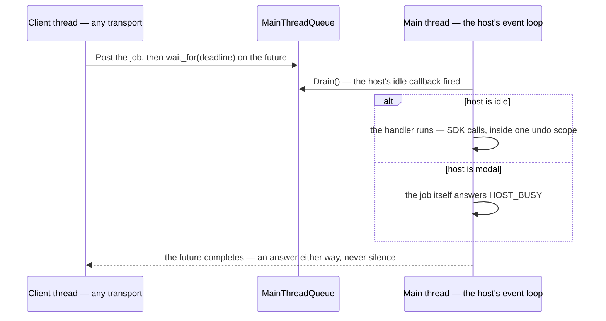

## Chapter 38 — The Bridge Out

Somewhere around month six the request arrives, and it is not about C++. The plug-in works; the pilot users want more of it; and the people who will build the next piece — the dashboard, the batch tool, the QA scripts — write C#, or Python, or TypeScript. Someone asks the reasonable question: *can the plug-in expose what it does, so the rest of us can drive it?* This chapter is for that meeting. It is the latest moment of need in this book — a design chapter for month six, not a survival chapter for week one — and it is the meeting where you are the person expected to already know.

The host's contract has three clauses, and you have been living under all of them since [Chapter 17](17-exercise-the-fakesdk.md#chapter-17--exercise-the-fakesdk): *C++, in my process, on my thread*. Notice that you learned the clauses in that order, and the last one late. [Chapter 16](16-the-sdk-bestiary.md#chapter-16--the-sdk-bestiary)'s Shape 1 described this host's API surface — error codes, out-parameters, owned payloads — and named no calling thread, because API descriptions never do; the thread arrived as [Chapter 29](29-concurrency.md#chapter-29--concurrency)'s bullet: hosts frequently require that their API be called only from the main thread, and what you need is "a queue your main-thread code drains" — C#'s synchronization context, except nothing does it for you. That sentence has been an IOU for nine chapters. This one pays it, because the moment foreign code wants to drive the host, that queue stops being a bullet point and becomes the load-bearing wall.

### What you expect, and what the host gives you

| You expect (managed world) | The host gives you |
|---|---|
| A stable public API, semantically versioned | Headers that change every release; recompile or be refused at load |
| Calls are thread-safe, or throw telling you they are not | Calls from the wrong thread corrupt the document now and crash later |
| A message pump you control, `await` on top of it | A message pump you do not own, which also runs the modal dialogs |
| A top-level handler catches whatever escapes | An exception unwinding into host frames takes the unsaved document with it |
| The runtime is simply there | No runtime; whoever needs one brings their own |

Keep the table. Every failure in this chapter is one of those rows arriving on schedule.

### The wrong turn, and the three families

The instinct trained by seventeen years of .NET is to bring the runtime to the code: load the CLR — or an interpreter, or a browser engine — into the host's process, and write the interesting parts there. It can be made to work, and sometimes it is even right. But three of its costs are invisible from the managed side, and each one is a row of the table above. **One runtime per process:** you do not control the other plug-ins on the machine, and whoever loads their runtime first wins — your .NET 8 code hosted by somebody else's .NET 6 fails on a missing API, and neither of you shipped a bug. **A shared crash domain:** an unhandled exception in your managed half unwinds through native frames and takes the host — and the user's unsaved work — with it, which is [Chapter 30](30-authoring-an-abi-boundary.md#chapter-30--authoring-an-abi-boundary)'s nothing-escapes-your-entry-points rule with the stakes raised to someone else's document. **Foreign windows:** the host manages palettes, docking, and modality for *its* dialogs; a window your runtime created is invisible to all of it — it will not dock, will not disable when the host goes modal, and floats behind the main window unless you wire ownership by hand.

So there are three families, and the order to consider them in is the reverse of the instinct. **First, the host's own automation channel** — many hosts already expose commands over HTTP, a scripting console, or a classic automation object, and frequently the SDK lets a plug-in register *additional* commands on that channel. If yours does, most of this chapter is already implemented, by the vendor, on the correct thread — extend it and ship this week. **Second, out of process:** the plug-in stays C++ and thin — a transport, a queue, a command registry — and everything interesting becomes a *client* in its own process, in any language, any runtime version, crashing in private. **Third, in process**, for the cases that genuinely need it: end-user scripting with an embedded interpreter, or a UI inside a host palette via an embedded browser control. Whichever family you land in, the core below is the same — the queue, the seam, the registry — which is why this chapter builds the core, keeps a short menu at the end, and leaves the full catalogue to [Appendix G](G-the-bridge-catalogue.md#appendix-g--the-bridge-catalogue).

### The one invariant

Every call into the SDK executes on the host's main thread, at a moment the host considers safe — the event loop idle, no modal dialog pumping, no other command mid-flight, a document actually open, and mutations wrapped in whatever transaction scope the host's undo system demands. Foreign code — another thread, another process, another language — never calls the SDK. It describes work, posts it to a queue, and waits for an answer; the main thread drains the queue when the host says it is safe, which is the one fact the vendor's idle callback knows and nobody else does.

> [!NOTE]
> **Surprise for C# devs:** you have called this dispatcher a thousand times — `Dispatcher.Invoke`, `SynchronizationContext.Post`, `Control.BeginInvoke` — and never once written one. There is no dispatcher here until you build it: the host's event loop predates your plug-in and owes it nothing.



**Thread affinity at the other end, too.** *Main thread* is what a native host means: one thread owns the event loop and the SDK, and everything else posts to it. None of that changes with the client's language — it is a statement about the host's SDK — but the far end usually has an affinity of its own, and it is not the one a C# developer expects. An asyncio loop belongs to the thread running it and a V8 isolate to the thread that entered it, so each ships exactly one call you may make from outside: `loop.call_soon_threadsafe`, `napi_call_threadsafe_function`. CPython's global interpreter lock — still there in the default build — is *not* that door: it is a lock any thread may take, which serialises bytecode without pinning it anywhere, so code holding it is single-threaded without being one-threaded and no closer to the loop's thread than you are.

### The queue

The whole of it, from `exercises/bridgelab/`:

```cpp
#pragma once
#include <cstddef>
#include <functional>
#include <future>
#include <mutex>
#include <queue>
#include <type_traits>
#include <utility>

class MainThreadQueue {
public:
    // Any thread. The job runs later, on the main thread; the future is how
    // the caller waits for the answer. The whole contract is that a job
    // accepted here is eventually RUN: policy (host busy, no document) lives
    // inside the job, which can answer no - never in the queue, because a
    // job dropped here is a client blocked on a future nothing will set.
    template <class F>
    auto Post(F fn) -> std::future<std::invoke_result_t<F>> {
        using R = std::invoke_result_t<F>;
        auto task = std::make_shared<std::packaged_task<R()>>(std::move(fn));
        std::future<R> fut = task->get_future();
        {
            std::lock_guard<std::mutex> lock(m_);
            jobs_.push([task] { (*task)(); });
        }
        return fut;
    }

    // Main thread only, at a point the host calls safe. Runs everything
    // queued so far, in arrival order, and returns how many jobs ran. A job
    // that pumps the event loop and lands here again nests to zero - the
    // jobs posted meanwhile keep their turn, on the next outer Drain.
    std::size_t Drain() {
        if (draining_) return 0;      // refuse to nest: no job runs inside a job
        draining_ = true;
        std::queue<std::function<void()>> batch;
        {
            std::lock_guard<std::mutex> lock(m_);
            batch.swap(jobs_);
        }
        const std::size_t ran = batch.size();
        while (!batch.empty()) {
            batch.front()();          // a throw stays inside the future:
            batch.pop();              // packaged_task catches it for the caller
        }
        draining_ = false;
        return ran;
    }

private:
    std::mutex m_;
    std::queue<std::function<void()>> jobs_;
    bool draining_ = false;           // main thread only - it needs no lock
};
```

Two design decisions in there carry the chapter. The queue *always* completes what it accepted — `Drain` runs every job, and any policy about the host being busy lives inside the job, which can answer no. And `Drain` refuses to nest, because reentrancy is not hypothetical: your handler opens a dialog, the dialog pumps the host's event loop, the host's idle callback fires, and `Drain` is suddenly executing *inside* a job it is executing. The guard turns that into "the new jobs wait one turn", which is boring, and boring is the point.

What the listing leaves to you is the **waker**: something must make the main thread call `Drain` soon after a post. In order of preference — the SDK's own "call me from the event loop" hook, which is the host telling you when it is safe and the right answer whenever it exists; a UI-toolkit timer on a hidden palette, coarse but honest; and posting a native message to the host's main window, which works but can be delivered *while a modal dialog pumps* — if you are reduced to it, the host-is-idle check inside the job is no longer belt-and-braces, it is the only gate you have. In the lab the harness stands in for the host and simply calls `Drain` in its loop.

### Break one — the queue that waits politely

Here is the version review waves through, because it reads as *defensive*:

```cpp
    // Main thread only. Be considerate: while the host is busy, not now -
    // the jobs can wait until it is free again.
    std::size_t Drain(bool host_is_idle) {
        if (!host_is_idle) return 0;
        std::queue<std::function<void()>> batch;
        {
            std::lock_guard<std::mutex> lock(m_);
            batch.swap(jobs_);
        }
        std::size_t ran = 0;
        while (!batch.empty()) {
            batch.front()();
            batch.pop();
            ++ran;
        }
        return ran;
    }
```

Run a client against it while the host shows a dialog, and nothing fails. The job sits in the queue; the client sits in `wait_for`; the demo works, because nothing in a demo is ever modal. Then a user opens *File → Print* while your dashboard refreshes, and the ticket that arrives — it will be worded exactly like this — is **"the client shows a spinner forever."** The queue is not wrong to refuse SDK work during a modal dialog; it is wrong to refuse *silently*. And the other tempting shape is worse: pop the job while busy without running it, and destroying the unrun `packaged_task` stores a `broken_promise` into the shared state — the client's `get()` throws `std::future_error` on a transport thread that almost certainly has no handler, and [Chapter 29](29-concurrency.md#chapter-29--concurrency) already told you what an exception with no handler does.

The fix is in the listing above: the queue completes everything, and the *job* answers `{false, "HOST_BUSY"}` — a distinct, documented, machine-readable refusal. The client shows "host is busy — close the dialog", retries on its own schedule, and nobody files the spinner ticket. Refusing work is a feature; it just has to arrive as an answer.

> [!TIP]
> **Key principle:** "A bridge completes every job it accepts and bounds every wait — HOST_BUSY is an answer the client can act on, silence is a hang, and a deadline turns a hang into a line number."

### Break two — waiting for the thread you are on

The registry below has one branch whose absence is invisible for months. Without it, `Invoke` has a single path — post the job, wait on the future:

```cpp
    // Any thread: post the job, hand back the future.
    std::future<CommandResult> Invoke(const std::string& name,
                                      const std::string& args) {
        auto it = handlers_.find(name);
        if (it == handlers_.end())
            return Ready({false, "NO_SUCH_COMMAND: " + name});
        const Handler& handler = it->second;
        return queue_.Post([this, handler, args]() -> CommandResult {
            if (!host_.IsIdle()) return {false, "HOST_BUSY"};
            return handler(host_, args);
        });
    }
```

Every transport thread is served correctly by that code, forever. Then family three arrives: an embedded scripting interpreter, running — where else — on the main thread, and a user's script calls the bridge. The job goes into the queue; the caller blocks waiting for a `Drain` that only the blocked thread can run. Nothing is corrupted and nothing is reported; the host simply stops, with one thread parked in `wait_for` and a work item that will never run sitting a few frames below it. The fixed `Invoke` checks: a caller whose id is the main thread's runs the job *inline* — it is already standing at the safe point — and gets a ready future back.

> [!WARNING]
> **Trap:** an unbounded `future.get()` is a bet that someone, somewhere, is flawless — and on the main thread it is a bet that the thread can outwait itself. Neither version gets a diagnostic from any tool in this book; both compile to a frozen host.

### Break three — the registry race

The third break is the only one a sanitizer catches, and it hides in the least suspicious line a C# developer writes. Registration looks like configuration, and configuration feels like it can happen whenever:

```cpp
    // The settings palette wires in one more command - after Start, while
    // four transport threads are already inside handlers_.find:
    std::thread configurer([&core] {
        core.RegisterCommand("export_report",
            [](IHostAdapter& h, const std::string&) -> CommandResult {
                return {true, h.SelectionJson()};
            });
    });
```

One thread writing a `std::map`, four threads reading it, no lock — [Chapter 29](29-concurrency.md#chapter-29--concurrency)'s definition of a data race, wearing setup code's clothing. Build with `-fsanitize=thread` and it is named on the first run:

```text
WARNING: ThreadSanitizer: data race
  Read of size 8 by thread T2:
    #2 std::map<std::string, BridgeCore::Handler>::find(...)
    #3 BridgeCore::Invoke(...) bridge_core.h:49
  Previous write of size 8 by thread T1:
    #0 std::__tree_right_rotate(...) __tree:260
    #5 BridgeCore::RegisterCommand(...) bridge_core.h:34
SUMMARY: ThreadSanitizer: data race in std::__tree<...>::__root()
```

The write frame is the map's red-black tree *rebalancing itself* under a reader — a lookup walking nodes while a rotation swings them. The fix costs nothing at runtime: registration happens on the main thread before serving starts, `Start()` draws the line, and an `assert(!started_)` makes crossing it loud. After the freeze the map is read-only, and concurrent readers of data no writer touches are legal — which is why `Invoke` needs no lock, and why the assert is load-bearing rather than decorative.

### The seam

Handlers need the host, and the chapter has so far waved at "SDK calls" without making any. That is deliberate, and it is [Chapter 28](28-testing.md#chapter-28--testing)'s move: the seam is designed first, as an interface, and the vendor's SDK becomes *one implementation of it*.

```cpp
#pragma once
#include <cassert>
#include <functional>
#include <string>
#include <thread>
#include <vector>

// One result shape for every command: ok plus a payload, or not-ok plus a
// reason the client can act on. The reasons are part of the wire contract -
// "HOST_BUSY" is documented as retryable, so a client shows "host is busy,
// close the dialog", not a spinner.
struct CommandResult {
    bool ok = false;
    std::string text;
};

// What the SDK looks like from the bridge's point of view. One
// implementation per host version translates these calls into vendor SDK
// calls; nothing else in the bridge ever sees a vendor type.
class IHostAdapter {
public:
    virtual ~IHostAdapter() = default;
    virtual bool IsIdle() const = 0;
    virtual std::string SelectionJson() = 0;
    virtual CommandResult RunUndoable(const std::string& label,
                                      const std::function<CommandResult()>& body) = 0;
};

// The stand-in - what FakeSDK and FakeDevice were for their chapters, a
// double you can run under the sanitizers on a machine with nothing
// installed. Every method opens by asserting the one contract no compiler
// checks: that the call arrived on the thread that built the adapter.
class StubHostAdapter : public IHostAdapter {
public:
    StubHostAdapter() : main_id_(std::this_thread::get_id()) {}

    bool IsIdle() const override {
        AssertMainThread();
        return !modal_;
    }
    std::string SelectionJson() override {
        AssertMainThread();
        return R"(["wall-17","door-3"])";
    }
    CommandResult RunUndoable(const std::string& label,
                              const std::function<CommandResult()>& body) override {
        AssertMainThread();
        CommandResult r = body();
        if (r.ok) undo_.push_back(label);   // one command = one undo step
        return r;
    }

    // Harness controls: the stub can do to you what a real host does.
    void SetModal(bool modal) { AssertMainThread(); modal_ = modal; }
    const std::vector<std::string>& UndoSteps() const {
        AssertMainThread();             // "every method" means every method
        return undo_;
    }

private:
    void AssertMainThread() const {
        // The habit this chapter trains: a function that touches the SDK
        // asserts the thread on its first line.
        assert(std::this_thread::get_id() == main_id_);
    }
    std::thread::id main_id_;
    bool modal_ = false;
    std::vector<std::string> undo_;
};
```

You have met this pattern three times — FakeSDK, FakeDevice, and comlab's FakeSDK2 — always built by someone else, standing in for a vendor. This is the first one you write yourself, and the naming is deliberate: the `Fake*` doubles are frozen vendor contracts you consume, while the stub is *yours* — the lab expects you to extend it. It earns its keep twice over. Every method asserts the calling thread, so the affinity invariant is checked at the last line of defence on every single SDK touch, in a place no handler can forget to write. And it makes the entire bridge — queue, registry, transport — runnable under the sanitizers on a machine with no host installed, which is what the lab does on every push.

### The registry

```cpp
#pragma once
#include <cassert>
#include <functional>
#include <future>
#include <map>
#include <string>
#include <thread>
#include <utility>

#include "host.h"
#include "main_thread_queue.h"

class BridgeCore {
public:
    using Handler =
        std::function<CommandResult(IHostAdapter&, const std::string&)>;

    BridgeCore(IHostAdapter& host, MainThreadQueue& queue)
        : host_(host), queue_(queue), main_id_(std::this_thread::get_id()) {}

    // Main thread, before Start - and never after: the map is written here
    // and read from every transport thread, so the freeze IS the lock.
    void RegisterCommand(std::string name, Handler handler) {
        assert(!started_);
        handlers_[std::move(name)] = std::move(handler);
    }

    // The line between wiring and serving. After it, handlers_ is read-only,
    // and concurrent readers of a map no writer touches are legal (Chapter
    // 29: a race needs a writer) - so Invoke needs no lock at all.
    void Start() { started_ = true; }

    // Any thread. The future completes when the main thread has answered -
    // with the result, or with a refusal like HOST_BUSY; never silently not
    // at all. The caller owns the wait, and bounds it (see the harness).
    std::future<CommandResult> Invoke(const std::string& name,
                                      const std::string& args) {
        assert(started_);             // reading started_ is safe: written once,
                                      // before any transport thread existed
        auto it = handlers_.find(name);
        if (it == handlers_.end())
            return Ready({false, "NO_SUCH_COMMAND: " + name});
        // The job captures by value, deliberately: it outlives this frame
        // whenever the caller gives up waiting, and a job must own what it
        // reads - Chapter 22's lesson, now with a thread on each side.
        const Handler& handler = it->second;
        auto job = [this, handler, args]() -> CommandResult {
            if (!host_.IsIdle())
                return {false, "HOST_BUSY"};    // a refusal is a result
            return handler(host_, args);
        };
        // A caller already on the main thread cannot wait for the main
        // thread. Run the job right here instead: this call IS at the safe
        // point, because the main thread is in it and not mid-Drain.
        if (std::this_thread::get_id() == main_id_)
            return Ready(job());
        return queue_.Post(std::move(job));
    }

private:
    static std::future<CommandResult> Ready(CommandResult r) {
        std::promise<CommandResult> done;
        done.set_value(std::move(r));
        return done.get_future();
    }

    IHostAdapter&    host_;
    MainThreadQueue& queue_;
    std::thread::id  main_id_;
    bool             started_ = false;
    std::map<std::string, Handler> handlers_;
};
```

Three details, each already earned. The handler and arguments are captured **by value** — the job outlives `Invoke`'s stack frame the moment a caller gives up waiting, and [Chapter 22](22-exercise-lambda-lifetimes.md#chapter-22--exercise-lambda-lifetimes)'s rule does not soften because the dangling would happen on somebody else's thread. The main-thread caller runs inline, which is break two's fix. And `started_` is written once, before any transport thread exists — thread creation publishes it, so the reads in `Invoke` are safe without an atomic, and the comment says so because the *next* reader of this code will not have this chapter open.

> [!TIP]
> **Key principle:** "Foreign code never calls the SDK — it posts a job to the main thread's queue and waits, with a deadline, for the answer; and on the main thread itself I run the job inline, because the one thread that drains the queue cannot also wait on it."

### The judge

Two of the three breaks are hangs, and a hang is the one failure `build_all.sh` cannot see: a script with no timeout does not fail on a stuck binary, it *stops* — and CI stops with it, until some job-level timeout kills everything with a log naming nothing. [Chapter 34](34-parse-this-capture.md#chapter-34--parse-this-capture) brought a hand decode because the sanitizers were silent, [Chapter 36](36-the-host-stutters.md#chapter-36--the-host-stutters) an allocation counter for the same reason; this lab's judge is a **bounded wait**:

```cpp
// Failures are counted, never thrown: a transport thread reporting through
// an exception would just terminate (Chapter 29). Atomic, because EXPECT
// runs on the client threads too.
static std::atomic<int> g_failures{0};
#define EXPECT(cond)                                                          \
    do {                                                                      \
        if (!(cond)) {                                                        \
            std::fprintf(stderr, "FAILED %s:%d: %s\n", __FILE__, __LINE__,    \
                         #cond);                                              \
            ++g_failures;                                                     \
        }                                                                     \
    } while (0)

// The judge this lab needs: a bounded wait. Two of the chapter's three
// breaks are hangs, and a hang cannot fail this harness - it stops it, and
// CI with it, until some job-level timeout fires naming nothing. So no wait
// in this file is unbounded: every invoke takes a deadline, and a timeout
// is a failed EXPECT with a line number instead of silence.
static CommandResult InvokeChecked(BridgeCore& core, const std::string& name,
                                   const std::string& args,
                                   std::chrono::milliseconds deadline) {
    std::future<CommandResult> fut = core.Invoke(name, args);
    const std::future_status verdict = fut.wait_for(deadline);
    EXPECT(verdict == std::future_status::ready);
    if (verdict != std::future_status::ready)
        return {false, "DEADLINE_EXCEEDED"};
    return fut.get();
}
```

The harness around it runs four client threads, two hundred calls each, against a main thread that drains and goes modal one drain in four — so refusals genuinely happen, hundreds of them per run — and then checks the ledger: every call answered as a result or a `HOST_BUSY`, every successful mutation exactly one undo step in the stub, no wait past its deadline. Two deterministic phases follow with the concurrency turned off. The first is break two run against the fix — an `Invoke` from the main thread itself, with nothing draining any more, so only the inline path can answer at all — then a refusal (`SetModal(true)`, and the result *is* `HOST_BUSY`), then an unknown command. The second is the reentrancy guard's proof:

```cpp
    // Phase 3 - reentrancy. A job that pumps the queue must nest to zero,
    // and the job posted meanwhile must still run one Drain later - kept,
    // not dropped: the queue completes everything it accepts.
    std::future<int> later;
    std::future<std::size_t> pumping = queue.Post([&queue, &later]() -> std::size_t {
        later = queue.Post([] { return 41; });
        return queue.Drain();          // nested: must refuse and run nothing
    });
    EXPECT(queue.Drain() == 1);        // ran the pumping job only
    EXPECT(pumping.wait_for(kDeadline) == std::future_status::ready);
    EXPECT(pumping.get() == 0);
    EXPECT(later.wait_for(std::chrono::milliseconds(0)) ==
           std::future_status::timeout);
    EXPECT(queue.Drain() == 1);        // the kept job runs now
    EXPECT(later.wait_for(kDeadline) == std::future_status::ready);
    EXPECT(later.get() == 41);
```

Its second half matters more than its first: the nested `Drain` refusing is safety, but the deferred job still running one turn later — kept, not dropped — is the queue holding its only promise under the exact condition that tempts it to break it.

### What crosses the boundary

Everything above moves a call; what is *in* the call decides whether the bridge survives its second year. The temptation is to serialize the SDK's own element struct — it is right there, and every field the client could want is in it. Do that and every host release is a wire-format change: the vendor renames three fields, and every client you have shipped breaks on the same day, in lockstep. The bridge speaks a **domain model it owns** — element, property, selection, defined by you, versioned by you — and the shim translates between that model and whatever this year's SDK headers look like. Three artifacts now version independently, and the whole design is one row of this table:

| Artifact | Rebuilt when |
|---|---|
| The C++ shim (transport + queue + SDK translation) | Every host release |
| The wire contract (your domain model) | When *you* decide, with semver |
| The clients (C#, Python, web) | When the wire contract changes |

If the shim is the only thing that rebuilds per host release, you have won.

> [!TIP]
> **Key principle:** "The vendor's types never appear on my wire — my bridge speaks a domain model it owns, the shim translates, and a host release rebuilds the shim and nothing else."

Two more rules ride the same boundary. **Transactions:** one command is one undo step, labelled with the command's name — that is what `RunUndoable` encodes in the lab — and a client needing twenty edits to read as one step sends one `batch` command, because a transaction is a callback scope on the main thread and there is no such thing as "begin now, commit on a later request". **Long operations:** a hundred-thousand-element walk on the main thread freezes the host's UI for its whole duration, so no call in the contract is unbounded — paginate (`offset`/`limit`), chunk the shim's iteration across event-loop turns by having the job requeue its own continuation, and let a client's cancel set a flag the chunk checks. The freeze is break one's spinner with the roles reversed: this time the host's user is the one staring at it.

### In the wild

- **The host's channel first.** Before building any of this, read the SDK's automation pages. A host that lets plug-ins register commands on its existing HTTP or scripting endpoint has already built the queue, the safe point, and the discovery story — your transport decision collapses to "extend theirs, add a WebSocket for events if they have none".
- **The transport menu, short form.** WebSocket plus JSON-RPC is the desktop-bridge sweet spot — one small dependency, bidirectional, browsers connect natively. gRPC when you own several clients in several languages and need streaming and deadlines. Named pipes or Unix sockets when the dependency budget is zero. Plain HTTP when request/response is genuinely all there is. The full prices — every option, with the decision table — live in [Appendix G](G-the-bridge-catalogue.md#appendix-g--the-bridge-catalogue).
- **Discovery is a file, liveness is a PID.** Bind to `127.0.0.1`, port zero; write `{pid, port, document, token}` to a per-user directory; clients scan, drop entries whose process is dead, and send the token on every request. Multiple host instances fall out for free.
- **Events fan out through bounded queues.** SDK notifications arrive on the main thread; convert each to a record, push into a per-subscriber bounded queue, and let the transport's writer thread drain it. A slow subscriber loses events or the connection — never the main thread's time.
- **In-process rules, if family three is forced on you.** Load the runtime lazily, never during `DllMain` or a static initializer ([Chapter 32](32-it-crashes-on-exit.md#chapter-32--it-crashes-on-exit)'s territory, with a loader lock added); wrap every entry point ([Chapter 30](30-authoring-an-abi-boundary.md#chapter-30--authoring-an-abi-boundary)); and budget for the day another plug-in loads a different runtime version first.

### Pitfalls

- **It worked from `Task.Run` in the demo.** A wrong-thread SDK call rarely faults at the call site — it corrupts state the main thread reads later ([Chapter 33](33-here-is-the-report.md#chapter-33--here-is-the-report)'s lesson: distance between cause and symptom). The stub's per-method assert is cheap insurance you keep in debug builds forever.
- **The wire format was the SDK struct, serialized.** Every client broke on host-release day. The domain model exists so that day rebuilds one artifact, not your ecosystem.
- **`get()` without a deadline, in the client's shutdown path.** The host quit first, the future will never complete, and now the *client* hangs on exit. Two processes means two lifecycles; each must survive the other's death — bounded waits on both sides.
- **A transaction held open across requests.** It pins the host's undo machinery to your client's latency, and the first network hiccup leaves the document in a half-edited scope. Batch on the client, commit in one job.
- **The queue kept accepting while the host was gone.** Plug-in shutdown must fail pending jobs (`HOST_GONE`), stop the transport, and only then let the destructors run — a queue that outlives its drainer is break one again, permanently.

### Try it

The lab is `exercises/bridgelab/` — the task card walks the same road as this chapter, cold. In outline:

1. **Build the core from the constraints** — queue, stub adapter, frozen registry, and a harness in which *no wait is unbounded*. Do not look at the committed files until yours runs.
2. **Break one:** make your `Drain` polite, add a modal phase, and watch the deadline check fire where the spinner would be. Then try the dropping variant and meet `broken_promise` on a transport thread.
3. **Break two:** delete your inline branch and invoke from the main thread. With the deadline you get a line number; without it you get what the user gets — a host frozen mid-click.
4. **Break three:** register a command from a thread after `Start`, under `SAN=thread ../../scripts/check.sh main.cpp`, and read the report until the rotation-under-a-reader frame makes sense.
5. **Restore the fixes and hold both greens** — the canonical flags and the TSan build. The breaks split across the two builds, so each alone would call half of your bridge correct.
6. **Stretch:** a loopback-socket transport that parses lines into `Invoke` calls without touching `bridge_core.h` — and a `batch` command that makes twenty client edits one undo step.

What you should be able to say afterwards, from memory: why the queue completes even the jobs it refuses, why the main thread must never wait on its own queue, why registration freezes, and why every wait in the harness carries a deadline. Those four sentences are the bridge; the rest is transport.

<!-- nav:begin -->
[← Chapter 37 — No Repro, Dump Attached](37-no-repro-dump-attached.md) · [Contents](README.md) · [Appendix A — Fundamentals Refresher →](A-fundamentals-refresher.md)
<!-- nav:end -->
