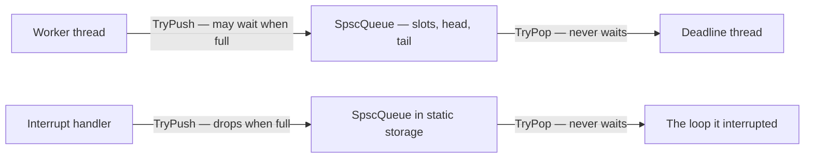

## Chapter 43 — Below the Mutex

Two chapters of this book disagree about the same callback. [Chapter 29](29-concurrency.md#chapter-29--concurrency) fixes a callback that arrives on a foreign thread with a mutex and a `push_back`, and that fix is right. [Chapter 36](36-the-host-stutters.md#chapter-36--dropouts-with-the-plug-in-loaded) shows a callback on a deadline thread and says it may allocate nothing, lock nothing, and block on nothing — so Chapter 29's fix is that chapter's bug. Both pitfalls sections say so and point at each other, which routes the prohibition and leaves the question open: once the deadline thread may not take a lock, how does data reach it at all? This chapter is the answer, and it is narrower than the title suggests. It is one structure — a bounded hand-off between exactly one producer and exactly one consumer — and the two words of `std::atomic` vocabulary that make it correct. Writing lock-free structures in general is not this book's job, and [ROADMAP.md](https://github.com/mkhomutov/going-unmanaged/blob/main/ROADMAP.md) says why; using one, inside a plug-in that ships, is.

### The deadline path, and who is allowed to wait

Chapter 36's rule follows from one property: every mechanism on its list has a worst case you do not control. A mutex is the clearest case, and the failure has a name — **priority inversion**. The deadline thread runs at the highest priority the host can give it. A worker thread takes the mutex, and the scheduler, seeing a low-priority thread doing nothing special, preempts it for something else. Now the deadline thread arrives, wants the mutex, and waits — not for the worker's ten instructions, but for however long the scheduler takes to get back to a thread it considers unimportant. The host's deadline passes. Nothing in your code was slow. The lock was held for a microsecond and the wait lasted a millisecond, and the thread that paid was the one that could not afford to.

So the hand-off has to have an asymmetry built in. The worker thread — the UI thread, the file reader, the network receiver — *may* wait: if there is no room for its sample, it can block, retry, or drop, and any of those is fine. The deadline thread may not wait for anything, ever: if there is nothing to read, that is an answer and it returns. A structure with that asymmetry, where the deadline side has a bounded, lock-free, allocation-free path in every case, is what this chapter builds.

> [!NOTE]
> **Surprise for C# devs:** you have used this structure without seeing it. `ConcurrentQueue<T>` and a bounded `Channel<T>` with `BoundedChannelFullMode.DropWrite` are the same idea with a runtime underneath; and C#'s `volatile` — a read with acquire semantics, a write with release semantics, under the CLR's memory model — is exactly the pair of memory orders this chapter teaches. The false friend is the other direction: C++'s `volatile` means none of that (Chapter 29's pitfall), and the word you reach for by reflex is the one that does nothing here.

### The hand-off

One producer, one consumer, a fixed ring of slots, and two indices. The whole reason it needs no lock is in the first sentence: each index has exactly one writer. The producer alone advances `tail_`; the consumer alone advances `head_`. Neither ever needs to *change* something the other is changing — the only question left is *when the other thread gets to see it*, and that is a question about memory ordering, not about mutual exclusion.

```cpp
--8<-- "exercises/deadlinelab/spsc_queue.h:listing"
```

Read `TryPush` as three steps: check for room, write the slot, publish the index. The third step is the one that matters. The slot is a plain `T` written with a plain assignment; the index is atomic. Without the `release` on the store, nothing orders the slot write before the index write — the compiler may reorder them, and so may the CPU, and a consumer that sees the new index may then read the *old* contents of the slot. With it, every write before the store is visible to any thread whose `acquire` load reads the stored value. `TryPop`'s acquire load of `tail_` is that thread: the pair is the whole synchronization, and the slot travels across it. The same pair runs the other way for `head_`, so the producer's acquire sees a freed slot only after the consumer has finished copying out of it.

Three things the listing refuses, each with a `static_assert`, because each would put back what the queue exists to remove. The element type must be trivially copyable: the consumer copies a slot, and a copy that allocates is an allocation on the deadline path. The index type must be lock-free: an atomic that is not `is_always_lock_free` is implemented with a mutex, which is the thing you were avoiding, in disguise. And the ring keeps one slot empty, so full and empty are distinguishable from the two indices alone — the alternative is a third counter that both sides write, and a counter both sides write is the shared state this design was built to avoid.

The picture, both directions at once — the second is the section on interrupt context, below:



### What memory_order buys, measured

Chapter 29's `std::atomic<int> counter{0}` with `++counter` used the default order, and never said what it was. The default is `memory_order_seq_cst` — every atomic operation is a full synchronization point in a single global order — and it is *correct* for the queue above: replace every `acquire` and `release` with the default and nothing breaks. The question is what the weaker orders buy, and the answer is machine-dependent, which is why this book measures rather than asserts it. Here is what one store and one load compile to, at `-O2`, for each order, on the two machines CI runs on:

| Order | arm64 (Apple silicon) store / load | x86-64 store / load |
|---|---|---|
| `relaxed` | `str` / `ldr` | `mov` / `mov` |
| `release` / `acquire` | `stlr` / `ldapr` (older cores: `ldar`) | `mov` / `mov` |
| `seq_cst` (the default) | `stlr` / `ldar` | `xchg` (or `mov` + `mfence`) / `mov` |

Two different lessons in one table. On x86-64 the hardware already orders every store after every earlier store and every load after every earlier load — *total store order* — so a release store and an acquire load are plain `mov`s, free, and the only thing the default costs you is that `xchg`: a full fence on every `seq_cst` store, tens of cycles, once per push and once per pop. On arm64 there is no such free lunch: the hardware reorders freely, a release store is a distinct instruction (`stlr`) that stops it, and the default and `release` cost the same. So on x86 the weaker orders buy speed and on arm64 they buy nothing over the default — and `relaxed` on arm64 buys you a bug. `check_platform_claims.sh` compiles that table on both platforms and reads the instructions back.

The bug is worth seeing, because it is the one Chapter 29 said you cannot test for. Take the ring above, change every order to `relaxed`, number every sample, and run it on this Apple-silicon machine:

```text
stale: got seq 46983, expected 47047 (head 8, tail 12)
```

Sixty-four behind — the ring has sixty-four slots — which is to say the consumer read the sample that occupied that slot *one lap ago*. The index had advanced; the slot had not, as far as this core could see. Six of eight runs at `-O0`, five of five at `-O2`, padded or not, and the same program with `acquire` and `release` restored delivered every sample in order in every run. On x86-64 the relaxed version passes — the hardware's ordering hides the missing one, which is the oldest bug report there is, *works on my machine*, with an instruction set for a machine. `check_platform_claims.sh` holds both: the stale read must appear on arm64 within a dozen runs, and must not on x86-64.

And the third sanitizer? It reported Chapter 29's kind of race — a flag stored relaxed and a value read after it — every time. On the ring it was unreliable: in the runs behind this chapter it reported the race with one index type and stayed silent with another, on the same machine, for the same missing order. TSan finds unsynchronized *accesses*; a memory order that is merely too weak leaves the accesses in place and removes the ordering between them, and whether TSan notices depends on which accesses its shadow memory still remembers when the second thread arrives. The judge for a wrong memory order is the harness's sequence check on a machine that reorders — which is why the lab's `main.cpp` numbers every sample.

> [!WARNING]
> **Trap:** `relaxed` is not "a bit faster". It is *no ordering at all* with respect to every other location, and a program that uses it to publish data is broken on the arm64 machine your customers increasingly have, while passing every test on the x86-64 machine you develop on. Use `relaxed` for a counter nobody reads together with anything else — the lab's interrupt count — and for a thread's read of its *own* index. Everything that publishes uses `release`; everything that consumes uses `acquire`.

### Two indices, two cache lines

The three `alignas(kSeparation)` in the listing are [Appendix L](L-what-things-cost.md#the-cost-that-hides-in-the-layout)'s row on the cache line two counters share, applied. `head_` is written by one core and `tail_` by the other; if they sit in one cache line, every write by either core invalidates the other core's copy of the line, and two threads touching two *different* variables pay for a shared one. Separating them costs a few hundred bytes of padding per queue and nothing else. The number is the interesting part — Appendix L measured `std::hardware_destructive_interference_size` at 256 on the machine this chapter was written on, where everybody types 64 — so the constant here is named for what it is, the distance this code chose, and 128 is the choice: two lines' worth on the common hardware and one on Apple's.

### The judge

Chapter 36's instrument, an allocation counter in a replaced `operator new`, judged that chapter's fix. It counted the whole process, which was right for a harness with one thread of interest. Here the worker is *allowed* to allocate and the deadline thread is not, so the counter has to ask which thread it is on — and `thread_local` is the only way it can, since nothing else identifies the caller inside a replaced allocator:

```cpp
--8<-- "exercises/deadlinelab/main.cpp:counter"
```

The first phase of the harness is the worker-to-deadline-thread direction. It checks the bound single-threaded first — `Capacity` pushes succeed, the next is refused, one pop makes room for exactly one more — because that is a claim about the structure and one a timing cannot muddy. Then the threads: the worker pushes two hundred thousand numbered samples, waiting when the ring is full because it is the thread that can; the deadline thread drains a bounded number per tick, which is what a deadline callback does, and returns. Every wait has a deadline, for [Chapter 38](38-the-bridge-out.md#chapter-38--the-bridge-out)'s reason — a hand-off that stopped delivering would stop CI rather than fail it:

```cpp
--8<-- "exercises/deadlinelab/main.cpp:worker"
```

Three assertions, and each catches a different mistake. Every sample arrived — nothing was lost to a full ring or a stalled consumer. Every sample arrived *in order and once* — the memory orders did their job, on this machine. And the deadline thread allocated nothing, across the whole session, which is the number Chapter 36 said a timing cannot give you. On this machine the phase prints something like `200000 samples, 12122 ticks (4086 empty), 181 full-ring retries by the worker, 0 allocations on the deadline thread`: the ring filled and the worker waited, the ring emptied and the consumer returned, and neither event cost the deadline thread anything.

Now put Chapter 29's fix on the deadline thread and watch what the judge can and cannot see. A `Sink` with a mutex and a `std::vector`, the worker locking and pushing, the deadline thread locking and reading:

```cpp
struct Sink {
    std::mutex m;
    std::vector<Sample> samples;     // grows on the worker's side
};

// The deadline thread's tick. The counter reads zero: nothing here
// allocates on THIS thread. The lock is the bug, and no counter sees it.
void Tick(Sink& sink) {
    std::lock_guard<std::mutex> g(sink.m);     // held by a worker the scheduler
    for (const Sample& s : sink.samples) {     // has just preempted: the
        Consume(s);                            // deadline thread waits for it
    }
    sink.samples.clear();
}
```

The counter stays at zero for the deadline thread, because the vector grows on the *worker's* side — run it and it does. The judge is silent on the lock. That silence is the honest limit of this instrument: an allocation counter sees allocations, and a lock is not one. What sees a lock on a deadline path is the tool Chapter 36's "In the wild" named and this book's baseline toolchain does not yet ship, RealtimeSanitizer — and, until then, the review question *who could be holding this when I arrive?* asked at every `lock_guard` on a thread with a deadline.

### From interrupt context — Shape 4's other addition

Chapter 16's Bestiary said Shape 4, the embedded HAL, is Shape 1 with two additions, and then taught one of them: Chapter 32 is the whole of "ownership is initialization order". The other — *callbacks may run in interrupt context* — has been one sentence for the entire book. This is where it is paid, because it is this chapter's rule under a harder deadline, and the same structure answers it.

An interrupt handler does not run on a thread of its own. It runs on whatever the processor was doing when the interrupt arrived — in the middle of your main loop, between any two instructions — to completion, and then the loop resumes as if nothing happened. That single fact turns each of Chapter 36's *should nots* into a *cannot*:

- **It cannot block, on anything, ever.** A deadline thread that takes a lock held by a worker waits until the worker is scheduled. An interrupt handler that takes a lock held by the code it interrupted waits until that code runs again — and that code cannot run until the handler returns. That is a deadlock with one thread, and no sanitizer names it, as the listing at the end of this section shows. The allocator is a lock too (Chapter 36), so "no allocation" stops being advice about latency and becomes a rule about not freezing the device.
- **It cannot take a context pointer.** A handler has the signature the hardware gives it — or the vendor's table does — and no `void*` rides along. Chapter 18's trampoline pattern has nothing to cast. Everything a handler touches must therefore be reachable by name, at namespace scope, and must exist before `main` runs: static storage, constant-initialized, never a local of anything.
- **Everything it touches must be lock-free or `volatile sig_atomic_t`.** An atomic that is `is_always_lock_free` is safe to use from a handler; one that is not is a mutex, and the previous rule applies. The queue's `static_assert` is that requirement written down.

The hand-off *out* of interrupt context is the queue above, unchanged, with the handler as producer. The one change is in policy: the handler cannot wait when the ring is full, so it drops the sample and counts the drop — and the count is what tells you the ring was too small, which is a design decision the main loop can act on, where a hung device is not.

A desktop has no interrupts you can register from user space, but it has the thing that behaves like one: a POSIX signal handler, which interrupts the thread wherever it is, runs to completion on that thread with no context pointer, and is subject to exactly the same three rules (the standard even publishes the list of functions it may call, and `malloc` is not on it). The lab's second phase is that: a timer signal every millisecond, a handler that pushes into a queue in static storage, and the main loop draining it — the interrupt count `relaxed`, because nothing is published through it, and the drop count `relaxed` for the same reason:

```cpp
--8<-- "exercises/deadlinelab/main.cpp:interrupt"
```

The handler runs on the main thread, so the same thread-local counter judges it — and `0 allocations` there is a claim about the handler *and* the loop it interrupted, since the counter cannot tell them apart and does not need to. What the harness cannot check is the version that hangs. Take Chapter 29's fix into the handler, and let the interrupt arrive while the loop is inside its own critical section — which, over a long enough session, it will:

```cpp
--8<-- "scripts/check_platform_claims.sh:isr-lock"
```

It never prints. One thread, waiting for itself; plain, under ASan/UBSan and under TSan, the process simply sits there, and every sanitizer sits with it. `check_platform_claims.sh` asserts exactly that, bounded, on both platforms, because a demonstration whose only outcome is silence needs a script that treats silence as the answer.

The rule for the reader who never ships to a microcontroller: this shape reaches the desktop. A CAN stack or a Modbus library calls your receive callback from its driver context, a kernel-mode audio driver's callback is one, and any vendor header that says "must return within N microseconds" or "do not call any API function from this callback" is telling you, in its own words, that you are in this section.

### Pitfalls

- **A `std::function` in the slot.** It looks like a queue of work, and it allocates on assignment for any callable larger than its small buffer — on the producer's side, which the counter permits, and on the consumer's the moment the slot is copied out. The slot is trivially copyable, which the `static_assert` enforces; if what crosses is *work*, cross a small integer or enum that names it and keep the work on the deadline side, preallocated.
- **A bounded queue that waits when full — on the wrong side.** The producer blocking is fine and the consumer blocking is the bug, and the API above cannot express either: both return `false` and leave the decision to the caller. A queue whose `Pop` blocks when empty is a condition variable with a different name, and it belongs on the worker's side of the world.
- **Two producers.** Register the trampoline for two devices, or let a second thread post into the same ring, and the invariant that made it lock-free — one writer per index — is gone. The failure is silent and rare, which is the worst kind. A multi-producer queue is a different structure with a compare-and-swap in it; the day you need one, take it from a library that publishes its proof, and Chapter 27's rules for a dependency apply.
- **`reserve` as a guarantee.** A `std::vector` that was reserved for a thousand samples allocates on the thousand-and-first `push_back`, on whichever thread happened to push it, on whatever day the load went up. Preallocation is a fixed-size array or a ring, not a hint to a container.
- **`relaxed` for speed on the machine that hides it.** The table above: on x86-64 nothing is lost, and the test passes; on arm64 the sample arrives one lap old. The order that publishes is `release`, always, and the cost on the machine where it is not free is the cost of being correct there.
- **A lock in a signal handler or an interrupt — or a `printf`, or a `std::string`.** Each is a lock the interrupted code may hold. The three ways to know you are in this context: the callback has no context pointer, the vendor's header says how fast you must return, or the word *ISR*, *interrupt* or *driver context* appears anywhere near the registration function.
- **Testing on one instruction set.** Every claim in this chapter with a platform in it was found by running on the other one. If the deadline path ships to arm64, it is tested on arm64, and the sequence check is the assertion.

> [!TIP]
> **Key principle:** "Data reaches a deadline thread through a bounded ring with one producer and one consumer, never through a lock: the writer publishes with release, the reader takes with acquire, the deadline side never waits, and an interrupt handler is the same rule with waiting removed entirely — nothing it touches may block, and everything it touches exists before main."

### In the wild

The structure above is the one every real-time codebase ends up owning, usually under a name. PortAudio ships it as `PaUtilRingBuffer`, JUCE as `AbstractFifo`, and the Linux kernel as `kfifo`; `boost::lockfree::spsc_queue` and the widely copied `ReaderWriterQueue` are the same two indices with more engineering around the corners, and every game engine's render thread receives its frame through one — a double or triple buffer is a ring with two or three slots. The microcontroller world has its own spelling for the interrupt half: FreeRTOS's `xQueueSendFromISR` is `TryPush` with the drop policy built in, and every HAL's "defer to the main loop" pattern is this chapter's second phase. C# arrived at the same shape from the other direction: `Channel.CreateBounded` with a drop mode, and the `Volatile.Read`/`Volatile.Write` pair that low-latency .NET code uses where a `lock` would stall the audio thread — acquire and release with the runtime's names on them. And the tool that turns this chapter's rules into a build failure is arriving: RealtimeSanitizer, in recent Clang, aborts the run the moment a function marked `[[clang::nonblocking]]` allocates or locks — Chapter 36's counter and this chapter's lock rule, promoted into the sanitizer family, for the day the baseline toolchain catches up.

### In Rust

Rust took its `Ordering` — `Relaxed`, `Acquire`, `Release`, `SeqCst` — from C++11 by name and meaning, so the table above reads unchanged. What changes is who checks the invariant: a Rust ring's slots would be `UnsafeCell`s, and the two-thread access to them an `unsafe` block whose safety comment *is* the sentence "one writer per index" — the compiler will not let the structure exist without someone writing that argument down. That is the difference in a sentence: in C++ the invariant is a comment the sanitizer sometimes checks; in Rust it is a comment the compiler demands.

### Try it

The task card is `exercises/deadlinelab/TASK.md`; `spsc_queue.h` and `main.cpp` beside it are the worked result, so do the card cold first and compare afterwards.

1. **Build the ring from the constraints** — one producer, one consumer, a fixed array, two atomic indices, `TryPush` and `TryPop` that never wait — before reading the listing. Decide how full and empty are told apart, and where each memory order goes, and write down why for each one.
2. **Judge it with the harness.** Number every sample. Check order, completeness, and zero allocations on the consumer's thread, and give every wait a deadline.
3. **Weaken it.** Change every order to `relaxed` and run twenty times. On arm64 you will see the stale slot; on x86-64 you will see nothing, which is the more important observation. Restore the orders and confirm the stale read is gone.
4. **Put Chapter 29's fix on the deadline thread** — a mutex and a vector — and watch the allocation counter stay at zero. Say what the judge cannot see, and what could.
5. **Make the producer an interrupt.** A timer signal, a handler with no context pointer, a queue in static storage, a drop count. Then, on the card, take a lock in the handler and watch the process stop — under all three sanitizers.
6. **Stretch: size the ring from the drop count.** Shrink the interrupt phase's ring until drops appear, and reason about the relationship between the interrupt rate, the loop's worst-case iteration, and the ring size. That relationship is the design, and it is the number a vendor's "must return within N microseconds" is asking you to compute.
