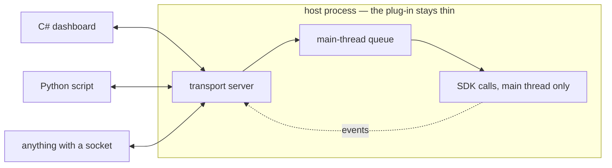

## Appendix G — The Bridge Catalogue

[Chapter 38](38-the-bridge-out.md#chapter-38--the-bridge-out) builds the part of a bridge that never changes — the queue, the seam, the registry, the bounded wait. This appendix is the part that does: the catalogue of mechanisms for connecting a foreign client to a native host, for the meeting where one must be chosen. It is lookup material, deliberately — each entry is a mechanism, its price, and the situation it wins in, and there is not a line of C++ on this page — one topology diagram and one JSON record are its only listings, because every compilable listing the subject needs already lives in the chapter and its lab.

Two standing notes before the list. Every mechanism here still obeys the chapter's one invariant — SDK calls on the main thread, at a point the host calls safe; the families differ only in *where the foreign code waits* while that happens. And this page ages on other people's schedules: runtimes, browser controls and RPC stacks version faster than books, so treat the shapes and the questions as durable, and re-verify any specific name the week you decide.

### Start here — the host's own channel

Many hosts already expose an automation surface to the outside world — an HTTP/JSON endpoint, a scripting console, a classic automation object — and frequently the SDK lets a plug-in **register additional commands on that channel**. If yours does, most of Chapter 38 is already implemented, by the vendor, on the correct thread: the host dispatches to your handler at a point it considers safe, so the queue problem is solved by the party that actually knows the answer. Discovery, authentication, multi-instance handling, and any client libraries the host publishes come free; every language that can speak the channel is already a client; and where a community layer exists on top of it, extending that layer beats competing with it.

**Price:** the schema is the host's schema — loose typing and all; the channel is usually request/response only, so push events mean adding a small WebSocket of your own and owning two transports; and execution policy is the host's, so a long command blocks its UI unless the channel offers an asynchronous mode. **When:** you want a working multi-language client this week, or the product is "extra commands" rather than "a different UI". The shortest path that works — and often good enough to ship, permanently.

### Family A — the runtime moves in with you

The Chapter 38 costs apply to every entry here, so price them once: **one runtime per process** (whoever loads first wins, and you do not control the machine's other plug-ins), **a shared crash domain** (what escapes you takes the host's unsaved document), **foreign windows** (anything your runtime creates is invisible to the host's docking, layout and modality), and a startup tax paid at host launch unless you load lazily.

**Mixed-mode C++/CLI.** One DLL compiled with `/clr` holds both native code that includes the SDK headers and managed code — each side calls the other directly, no marshalling layer to design, the fastest possible prototype. **Price:** Windows-only; it welds the SDK version, the C++ toolchain and the .NET version into one artifact, so every host release rebuilds and revalidates everything at once; and managed code on load-time paths meets the loader lock ([Chapter 32](32-it-crashes-on-exit.md#chapter-32--crash-on-exit)'s territory with the OS holding the other lock). **When:** one team, Windows-only, both halves shipped together, forever.

**Hosting the runtime yourself.** The plug-in loads the runtime through its official hosting API — .NET's `nethost`/`hostfxr`, CPython's `Py_Initialize`, a Lua or small JavaScript engine linked in — and the two sides exchange plain C function pointers over POD structs and UTF-8 buffers. That boundary is a C ABI you fully control, which is [Chapter 30](30-authoring-an-abi-boundary.md#chapter-30--authoring-an-abi-boundary)'s third technique doing new work: the C++ shim rebuilds per host release, the managed half does not, and deployment is xcopy. **Price:** one-runtime-per-process is now *your* operational problem — roll-forward surprises, two plug-ins fighting over the one CPython, the GIL; marshalling is hand-rolled; and a UI framework needs its own thread with its own message pump, after which every SDK call rides the chapter's queue anyway. **When:** managed logic genuinely must be in-process, and you can audit what else loads on the machine.

**In-process COM.** [Chapter 35](35-still-live-at-unload.md#chapter-35--objects-still-live-at-unload) taught you the shape from the consuming side; here it is an activation mechanism: interface vtables behind GUIDs, registry-based discovery, and apartment marshalling that moves calls between threads for you. **Price:** Windows-only; registration wants an installer with elevation (registration-free COM inside a host-loaded DLL is workable and fiddly); and the runtime cost of Family A stands unchanged — COM is activation and ABI, not isolation. **When:** a Windows product with several independently shipped managed plug-ins and a team already fluent in Chapter 35's material.

> [!WARNING]
> **Trap:** apartment marshalling — and every in-process dispatcher like it — solves *transport*, not *safety*. A marshalled call is delivered whenever the main thread pumps messages, which includes inside a modal dialog; Chapter 38's is-the-host-idle gate stays yours to write no matter who moved the call.

**An embedded interpreter for end users.** A special case of hosting-it-yourself that deserves its own row, because the goal flips: not "our team writes the plug-in in Python" but "*our users* script the plug-in". Lua and the small JavaScript engines are a few hundred kilobytes, start in microseconds, sandbox well, and fight nobody over process-wide state — and the scripting surface is exactly the chapter's command registry exposed as functions, no new design required. **Price:** no UI toolkit of its own, so pair it with the host's dialogs or the browser palette below; choose CPython for this role and you inherit every hosting cost above. **When:** end-user scripting, or a plug-in that is itself a platform. The most defensible member of Family A.

**A browser in a host palette.** The host's dialog toolkit — or an embedding of the platform's browser control, with CEF as the study-worthy open-source route — shows a web view inside a *native palette*, and the UI becomes HTML and TypeScript talking to a small registered native object. Because the palette is a host dialog, docking, modality and layout save/restore all work — the foreign-windows cost vanishes — and the control delivers JavaScript calls on the main thread already, so the chapter's queue collapses to the is-idle gate. **Price:** you are pinned to whatever engine version the host ships, retested per release; the JS↔native surface is stringly typed and asynchronous, so design it small and treat it as an API; and it is a road to TypeScript, not to C# or Python. **When:** the UI is the product, must live inside the host, and must be cross-platform.

### Family B — the plug-in becomes a server

The plug-in stays thin — a transport server, the chapter's queue, the registry, event fan-out — and everything interesting becomes a client in its own process:



What every entry below buys, once: **isolation** — a client crashes in private, and when the host crashes the client shows "reconnecting" instead of dying with it; **any runtime, any version** — .NET 8 in one client, Python in another, nothing loaded into the host; **cross-platform by construction** — a shim that speaks a socket builds wherever the host runs; and **testability** — a stub server lets client teams work with no host installed, exactly as the chapter's stub adapter frees the shim. The standing costs, once: loopback round trips are real (design coarse, batchable calls, not five hundred per grid paint), and two processes means **two lifecycles** — the discovery record and its liveness check are Chapter 38's *In the wild* bullet — extended here with the two version fields a client checks before speaking — and the client-side bounded wait is its pitfall:

```json
{ "pid": 41288, "port": 51723, "hostVersion": "29.1",
  "bridgeVersion": "2.3.0", "document": "C:/work/tower.prj",
  "token": "b7e1..." }
```

A loopback-only bind plus that per-instance token is the right security posture for a desktop bridge; TLS on loopback buys nothing.

**HTTP + JSON.** An embedded HTTP server, one route per command. Every language is a client, and so is `curl`, which makes it the most debuggable option on the page. **Price:** no typed contract unless you add a schema on top; events bolt on badly (polling, or server-sent events and a second idiom); a round trip costs milliseconds, not microseconds. **When:** request/response is genuinely all there is. The default when nothing argues otherwise.

**WebSocket + JSON-RPC.** One persistent connection per client, and JSON-RPC 2.0 framing gives request/response *and* server-initiated notifications on the same socket, with per-connection ordering. Browsers connect natively, so one server can feed a palette UI (Family A's browser entry) and external tools alike. **Price:** no code generation — the schema discipline is yours to keep. **When:** events matter and the dependency budget is one small library. The sweet spot for most desktop bridges, and Chapter 38's own first recommendation.

**gRPC.** The contract *is* a `.proto` file — reviewable, semver-able, and it generates the C# and Python clients you would otherwise hand-write; calls carry deadlines that propagate, so a client's deadline arriving at the queue is Chapter 38's bounded wait running end to end; streaming is first-class for events. **Price:** a heavy C++ dependency tree with long builds, which must be static-linked with symbols hidden or it will collide with the host's own copies — [Chapter 27](27-dependency-management.md#chapter-27--dependency-management)'s diamond, at plug-in scale; browsers need a proxy. **When:** several clients you own, in several languages, with events and deadlines as first-class requirements.

What the generated C++ looks like, for the meeting — stated from the documentation rather than a build, so re-check the names the week you decide: the protoc plug-in emits a `Service` base class per service (Bestiary Shape 5: C++-native, virtual, yours to override), each method taking a `ServerContext*`, the request and a response out-parameter and returning a `grpc::Status` — Chapter 8's value pole, a code and a message, never a throw across the generated frame. The context carries the client's deadline (`context->deadline()`, and `IsCancelled()`), which is Chapter 38's bounded wait arriving from the other end: the job posted to the main-thread queue can be given the remaining time and refuse rather than run late. The server itself is a `ServerBuilder` bound to the loopback address, and its threads are its own, so every SDK call inside a handler rides the chapter's queue exactly as an HTTP handler would.

**Message queues — ZeroMQ, NNG.** Request/reply for commands, publish/subscribe for event fan-out; a tiny library with bindings in dozens of languages, carrying whatever serialization you choose. **Price:** no browser story, no schema, and strict lockstep request/reply until you adopt the router patterns. **When:** many small tools in many languages, high event volume, no web clients.

**Zero-copy formats — Cap'n Proto, FlatBuffers.** Messages laid out to be read in place, no parse step, for the day the payload is a mesh rather than a selection list. **Price:** thinner language coverage and tooling than JSON or protobuf. **When:** profiling proves serialization is the bottleneck. Not before.

**Named pipes and Unix-domain sockets.** OS-native and local by construction — no port, no firewall prompt, nothing listening that policy can object to — with your own framing on top, length-prefixed JSON being the usual answer. **Price:** framing, multiplexing and reconnection are yours to write, and naming and permissions differ per platform. **When:** the third-party dependency budget is zero.

**A shared-memory side channel.** Not a transport — a bulk lane beside one: the control message carries a handle to a mapped region, and the hundred-megabyte payload never crosses a socket at all. **Price:** lifetime and synchronization are entirely yours, and a leaked mapping outlives the process that made it. **When:** measured need, only. Recipe 43 in [Appendix F](F-rosetta-cookbook.md#appendix-f--the-rosetta-cookbook) is the lane, both platforms, with the rule that governs what goes in it: the region's layout is a wire format.

**Out-of-process COM.** The classic Windows automation model — the host process registers a class factory, external clients activate it, and every late-bound scripting tool on the platform can drive the result. **Price:** Windows-only, registry, DCOM marshalling quirks — and everything above it on this page is easier to build, deploy and debug. **When:** compatibility with an existing VBA/VBScript automation estate is the actual requirement. Otherwise skip.

### Family C — the runtime got there first, and loaded you

Families A and B assume the shape this book assumes everywhere: a native host, and your plug-in inside it, choosing how the outside world reaches in. Turn that picture over and you have the topology two whole populations of reader arrive with — a **managed runtime that already owns the process** and has loaded your native code as an extension. The JVM loading a JNI library. CPython importing an extension module. Node loading an N-API addon. The CLR calling into your DLL through `DllImport`, which is [Chapter 39](39-the-round-trip-home.md#chapter-39--the-round-trip-home)'s whole subject from the publishing side.

It is worth its own family because almost every price in Family A inverts. There, the runtime was a guest you invited and paid for; here it is the landlord, and the four costs that decided those entries are simply gone: you do not choose the runtime, you do not fight another plug-in over which version loads, you did not pay a startup tax, and the crash domain was never yours to share — it was always the runtime's. What replaces them is a different list, and it is shorter and harder.

**You do not own `main`, and you may not own the thread either.** Your code runs when the runtime calls it, on whichever thread the runtime happens to be on, and often on several over a process's life. Chapter 38's queue does not disappear; it turns around. There, foreign code posted work to the host's main thread. Here, *the runtime* is the thread with rules, and anything you spawn must come back to it — a JNI thread must `AttachCurrentThread` before it may touch a `JNIEnv`, and CPython's global interpreter lock must be held before your thread may touch a Python object at all. The bounded wait of that chapter is the same instrument for the same reason.

**Their garbage collector decides when your pointers stop being valid.** This is the lesson the book already teaches from the other side and nobody generalises: [Chapter 39](39-the-round-trip-home.md#chapter-39--the-round-trip-home)'s delegate that must stay rooted while native code holds it, [Chapter 22](22-exercise-lambda-lifetimes.md#chapter-22--exercise-lambda-lifetimes)'s capture that outlives its scope, and [Chapter 29](29-concurrency.md#chapter-29--concurrency)'s callback whose owner died — all one problem, and here it wears the runtime's vocabulary. A JNI local reference is valid until you return; a global reference lives until you delete it and leaks if you do not; a `PyObject*` is yours only while you hold a reference count that looks exactly like [Chapter 35](35-still-live-at-unload.md#chapter-35--objects-still-live-at-unload)'s. Every one of those is Chapter 16's question — *who releases this, and with which function* — asked by a runtime instead of a vendor.

**Errors travel by their rules, not yours.** An exception must not cross the boundary as a C++ exception ([Chapter 8](08-error-handling.md#chapter-8--error-handling-exceptions-and-error-codes)'s rule that does not bend); it is caught at the entry point and *converted* — `ThrowNew` on the `JNIEnv`, a `nullptr` return with the Python error indicator set, an `napi_status`. The shape is Chapter 8's translation layer with a different destination, and the entry-point `catch (...)` is the same line of code.

**The generated middle is where the work goes.** Nobody hand-writes this surface twice: JNI has `javac -h`, Python has pybind11 and Cython, Node has node-addon-api, and .NET has [Chapter 39](39-the-round-trip-home.md#chapter-39--the-round-trip-home)'s hand-written pair. What they generate is the marshalling; what they do not generate is the lifetime contract above, which is why the bugs in this family are lifetime bugs and not signature bugs.

**Price:** your build now serves *their* ABI and *their* packaging — a wheel, a JAR with a native payload per platform, a prebuilt binary per Node ABI version — so [Chapter 40](40-cmake-for-the-plug-in.md#chapter-40--cmake-for-the-plug-in)'s module and visibility work is done for a matrix rather than a target; a crash takes a process you did not start and whose users are not yours; and the diagnosis skills are [Chapter 37](37-no-repro-dump-attached.md#chapter-37--crash-at-session-close-field-units-only)'s, because the stack you are handed will be half managed frames. **When:** you are not choosing — the topology arrived with the job. The reason this family is here at all is that a reader who *is* in it should recognise how much of this book already applies to them.

> [!NOTE]
> **The big reveal:** this is the same page read from the other end. A native host with a managed client is Family B; a managed host with a native extension is Family C; and the code in the middle — a C ABI, a queue with a deadline, one owner per resource, nothing thrown across the seam — is identical in both. Which side you are on decides who waits, not what you write.

### The decision table

| You need | Reach for | Think twice about |
|---|---|---|
| A working multi-language client this week | the host's own channel | anything custom |
| A rich UI inside the host, cross-platform | the browser palette | mixed-mode; in-process COM |
| C# tools and dashboards against the host | a WebSocket or gRPC client, out of process | loading the CLR into the host |
| Several owned clients, typed contract, events | gRPC | HTTP alone |
| Events plus a web UI, minimal dependencies | WebSocket + JSON-RPC | gRPC's weight |
| End-user scripting | an embedded Lua/JS interpreter over the command registry | embedding CPython |
| Huge binary payloads, profiling in hand | a zero-copy format, plus the shared-memory lane | JSON anywhere near it |
| Zero third-party dependencies | named pipes / Unix-domain sockets | — |
| Legacy Windows automation compatibility | out-of-process COM | — |
| A managed runtime that already loaded you (JNI, an extension module, an addon) | Family C — their threading and lifetime rules, a generator for the marshalling | assuming the host-plug-in picture; it is inverted |

### The questions that decide it

Walk in with answers to these, and the table above collapses to a row or two: **who are the clients**, and in which languages — including the ones arriving next year; **do events push**, or is request/response honestly enough; **how big are the payloads**, measured, not guessed; **which platforms** does the host ship on, and must the bridge follow it everywhere; **what is the dependency budget**, in build time and in collision risk inside a process you do not own ([Chapter 27](27-dependency-management.md#chapter-27--dependency-management)); **whose machine is it**, and what else loads there — the question that prices all of Family A; and **does the host already have a channel**, which is the first section of this page and the last question most teams ask; and, before any of them, **which way round is this** — a native host you extend, or a managed runtime that has already loaded you, which is Family C and changes who is waiting for whom. Whatever wins, the part you build first is the part that is already built: the queue, the seam, the registry, and a judge with a deadline — [Chapter 38](38-the-bridge-out.md#chapter-38--the-bridge-out), unchanged under every row of the table.
