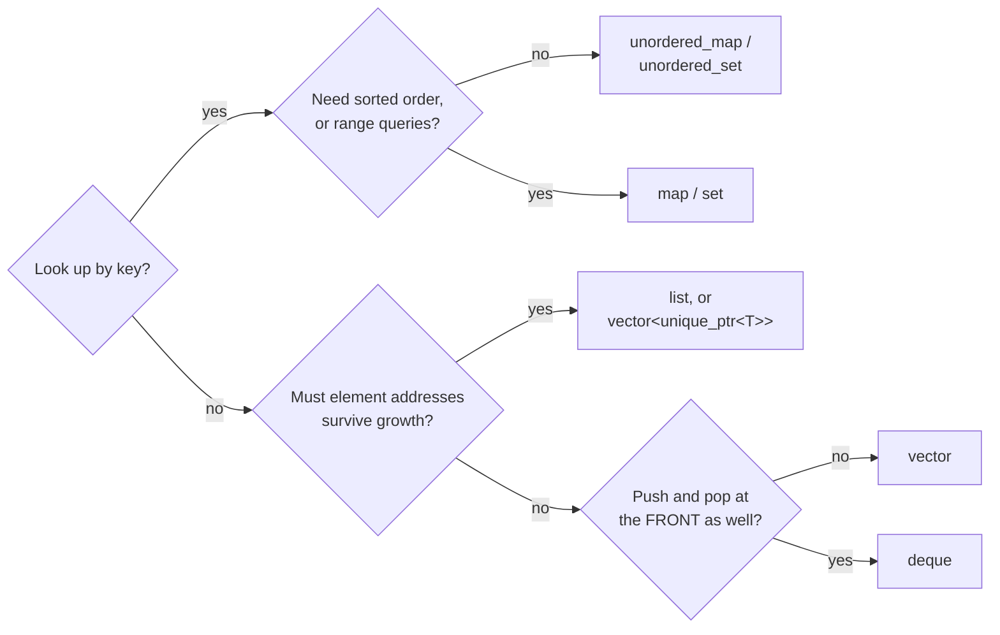
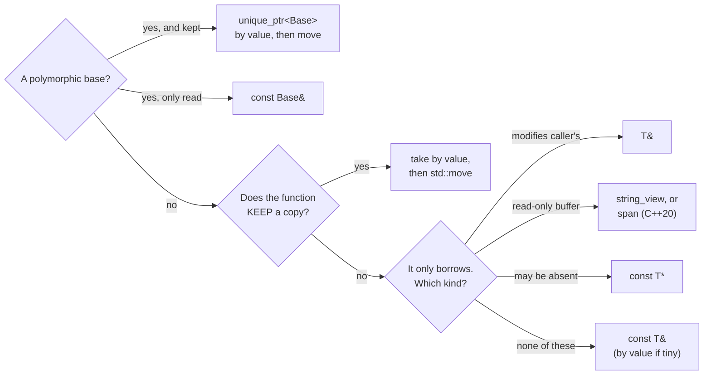
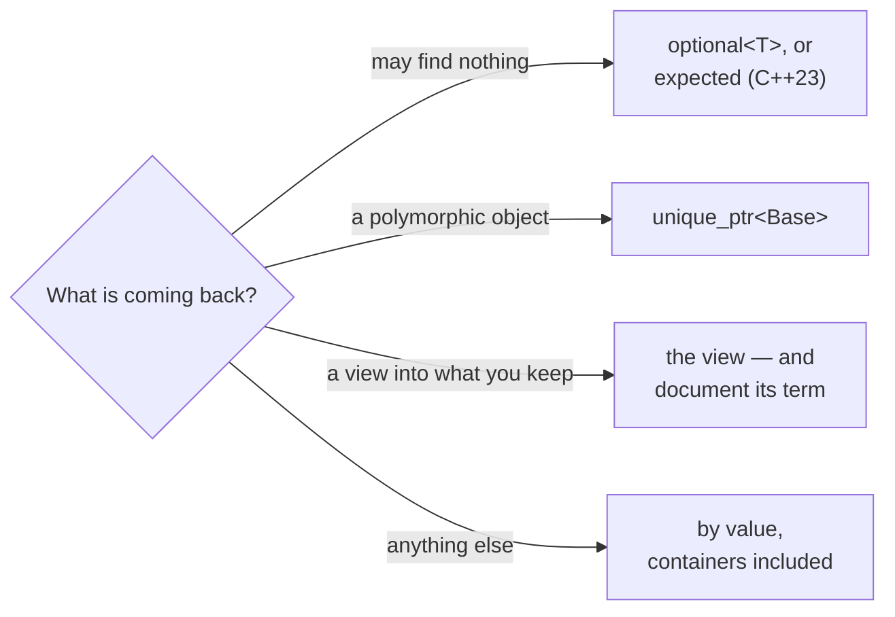
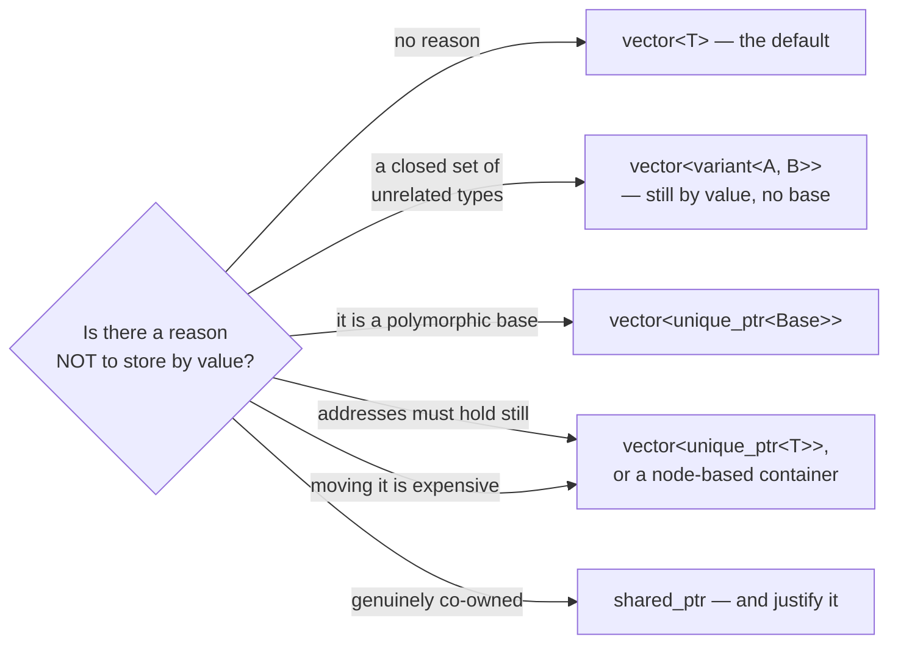

## Appendix H — Choosing: Signatures, Containers, and Storage

Four decisions stand between you and every function you will write in C++: which container holds this, how the function takes it, what it hands back, and — if it goes in a collection — whether it goes in as itself or behind a pointer. C# answered all four for you, identically, every time: a `List<T>` of references, a parameter that is a reference, a return that is a reference, and a collector to make lifetime somebody else's problem. Here each question has six or seven answers, the wrong one is usually silent, and you make the choice fresh in every signature.

This appendix is the procedure, for the moment you are at the keyboard rather than reading. The mechanisms live in the chapters and stay there — [Chapter 2](02-value-semantics.md#chapter-2--value-semantics) owns value semantics, [Chapter 6](06-the-rule-of-five-and-move-semantics.md#chapter-6--the-rule-of-five-and-move-semantics) moves, [Chapter 10](10-modern-cpp-fluency.md#chapter-10--modern-c-fluency) views, [Chapter 11](11-stl-containers-and-algorithms.md#chapter-11--stl-containers-algorithms-and-iterator-invalidation) containers, [Chapter 8](08-error-handling.md#chapter-8--error-handling-exceptions-and-error-codes) returning failure — and each branch below points at its owner. What is here and nowhere else is the *choosing*, plus the numbers behind it: every cost this page states is checked by `exercises/choosing/`, which `build_all.sh` builds and runs on every push — and builds twice for the return figures, the second time with elision switched off.

### The one question, asked four times

All four decisions are the same question at different scopes:

> **Who owns this, how long does it live, and who may see it?**

A **container** is the shape you have chosen for a whole population at once — the one decision that constrains the other three, because it fixes whether an element can be pointed at. A **parameter** is a loan for the duration of the call — unless the function keeps a copy, in which case it is a transfer. A **return** is a new object you have given away — unless it is a view into something you kept, in which case it is a loan whose term the caller cannot see. A **container element** is ownership for the container's lifetime, plus one promise the reader never thinks to ask about until it bites: whether the element's *address* survives the container growing.

[Chapter 33](33-here-is-the-report.md#chapter-33--here-is-the-report) named this vocabulary while debugging a dangling pointer — *"the loan sentence is everywhere once you look for it."* It is: the four procedures below are that sentence, written four ways.

> [!TIP]
> **Key principle:** "Before I write a signature I ask who owns this, how long it lives, and who may see it — one question, and the four answers are the container, the parameter, the return, and what goes in the collection."

---

### Procedure 1 — which container

Start here, because the other three lean on the answer.



One case sits outside that trunk because it is a different question: if the size is a compile-time constant, the answer is `std::array<T, N>`, which stores its elements inline and asks for no heap block at all. Everything else starts at the top. `vector` is the answer far more often than a C# developer expects, because contiguity beats theoretical complexity at every size that fits in cache ([Chapter 11](11-stl-containers-and-algorithms.md#chapter-11--stl-containers-algorithms-and-iterator-invalidation)) — reach past it only when this table names something you actually need.

Which C# collection each one answers to is [Chapter 11](11-stl-containers-and-algorithms.md#chapter-11--stl-containers-algorithms-and-iterator-invalidation)'s container map, and it stays there — including the sets and adapters this procedure never has to route to. What follows is only what decides between them:

| Container | Take it when | Elements stay put? |
|---|---|---|
| `std::vector<T>` | the default — indexing, iteration, growth at the end | **no** — growth moves everything |
| `std::deque<T>` | you push and pop at *both* ends — the C# `Queue<T>` used from either side | references survive end-insertion |
| `std::unordered_map<K,V>` | keyed lookup, no ordering needed | **references yes**, iterators no (rehash) |
| `std::map<K,V>` | sorted iteration, or "nearest key" queries | **yes** |
| `std::list<T>` | splicing whole ranges; almost never otherwise | **yes** |
| `std::array<T,N>` | fixed size, no heap block at all | **yes** — it never grows |

The last column is the one no C# habit prepares you for, and procedure 4 spends it. In C# every collection holds references, so "does the element move?" is a question without meaning — the object never moves, only the reference to it is copied. Here a `std::vector<T>` holds the objects *themselves*, and growing it relocates every one. The fuller invalidation rules — which operations kill iterators as well as references — are [Chapter 11](11-stl-containers-and-algorithms.md#chapter-11--stl-containers-algorithms-and-iterator-invalidation)'s to state; this column is only the part that decides a container.

> [!WARNING]
> **Trap:** the first branch above is the one a C# developer answers from memory and gets wrong — reaching for `map` because it sounds like `Dictionary`, when `unordered_map` is the equivalent and `map` is the tree. [Chapter 11](11-stl-containers-and-algorithms.md#chapter-11--stl-containers-algorithms-and-iterator-invalidation) states the gotcha and what it costs; here it is simply the branch to slow down on.

### Procedure 2 — how to take a parameter

Ask about polymorphism **first**. Every other branch below assumes the parameter's type is the whole object, and for a base class that assumption is what slices it ([Chapter 2](02-value-semantics.md#chapter-2--value-semantics), and [Chapter 20](20-exercise-slicing-and-polymorphism.md#chapter-20--exercise-slicing-and-polymorphism)'s lab). Only once polymorphism is ruled out does the question that decides everything else apply: **does this function keep a copy?**



Branch by branch, with the reflex each one confronts:

| Branch | Spelling | Use it for | The C# reflex it confronts |
|---|---|---|---|
| **Polymorphic, kept** | `void Add(std::unique_ptr<Shape> s)` + `std::move` | storing a base-class object | in C# the variable is already a reference; here a by-value `Shape` parameter keeps only the `Shape` part |
| **Polymorphic, read** | `void Draw(const Shape&)` | any base-class parameter you only look at | taking `Shape` by value **slices** ([Chapter 2](02-value-semantics.md#chapter-2--value-semantics)); C# cannot express the mistake |
| **Sink** | `void Set(T v)` + `std::move` | setters, constructors, anything storing a non-polymorphic argument | in C# you assign the reference and it is free; here the copy is real, and this shape lets the *caller* decide whether to pay |
| **Mutator** | `void Fill(T& out)` | genuinely modifying the caller's object | C#'s `ref`, but implicit at the call site — the reader cannot see it |
| **View** | `void Log(std::string_view)` | read-only strings and buffers | `ReadOnlySpan<char>`; accepts literals, `std::string`, and substring views without allocating |
| **Optional** | `void Try(const T* p)` | "there may be nothing here" | a nullable reference — but here `nullptr` is the *only* signal, so document it |
| **Borrow** | `void Read(const T&)` | everything else you only look at | the default, and the closest thing to the C# feel |

**A note on standards.** `std::string_view` is C++17 and available everywhere in this book. Its any-buffer generalisation **`std::span<T>` is C++20** — the exercises here compile as C++17, where you spell the same thing as the pointer-plus-length pair of [Chapter 16](16-the-sdk-bestiary.md#chapter-16--the-sdk-bestiary)'s C APIs ([Chapter 10](10-modern-cpp-fluency.md#chapter-10--modern-c-fluency)). Check your standard before reaching for `span`; the harness for this page cannot, which is why it is the one branch here carrying no measured number.

**About `&&`.** You may have listed it among the options; the procedure deliberately never routes you there. An `&&` parameter is a tool for library authors — the move constructor and move assignment of the Rule of Five ([Chapter 6](06-the-rule-of-five-and-move-semantics.md#chapter-6--the-rule-of-five-and-move-semantics)), and overload pairs inside containers. In application code the sink shape above does the same job with one overload instead of two, and reads as intent rather than mechanism. Writing `void Set(T&& v)` in ordinary code usually means you wanted a sink and reached one layer too deep.

**What the sink costs, exactly.** The recommendation is worth its cost only if you know the cost, so `exercises/choosing/passing.cpp` counts it. Against the obvious alternative — `const&` and assign — the sink wins where callers pass temporaries and loses where they pass lvalues:

| The caller passes | `void SetPayload(Counted c)` + move | `void SetPayloadByRef(const Counted&)` |
|---|---|---|
| a temporary | 0 copies, 1 move | **1 copy** |
| an lvalue it keeps using | **1 copy**, 1 move | **1 copy** |
| `std::move(x)`, done with `x` | 0 copies, **2 moves** | **1 copy** |

Two moves, in that last row, because `std::move` is a cast and nothing else ([Chapter 6](06-the-rule-of-five-and-move-semantics.md#chapter-6--the-rule-of-five-and-move-semantics)): one move constructs the parameter, one moves it into the member.

```cpp
class Widget {
public:
    void SetPayload(Counted c) { payload_ = std::move(c); }

    // The const& alternative, for comparison. It cannot steal: assigning
    // from a const reference copies, whatever the caller passed.
    void SetPayloadByRef(const Counted& c) { payload_ = c; }

private:
    Counted payload_;
};
```

**And the cost that table cannot see.** Copies and moves are not the whole price. A by-value parameter is a *new* object, so its buffer is a fresh allocation; a `const&` copy-assignment writes into the buffer the member already owns. For a setter called once, that is nothing. For one called repeatedly with an lvalue — the shape of every `SetName` on a hot path — the sink allocates every time and the borrow allocates never:

```cpp
void TheSinkAllocatesWhereTheBorrowDoesNot() {
    Counted keep("mine");
    Widget sink;
    Widget borrow;
    sink.SetPayload(keep);              // warm both members to the same
    borrow.SetPayloadByRef(keep);       // size, so only the steady state counts

    const long a0 = Allocations();
    for (int i = 0; i < 100; ++i) sink.SetPayload(keep);
    const long sink_allocs = Allocations() - a0;

    const long b0 = Allocations();
    for (int i = 0; i < 100; ++i) borrow.SetPayloadByRef(keep);
    const long borrow_allocs = Allocations() - b0;

    CHECK(sink_allocs == 100);      // one per call: the parameter is a new string
    CHECK(borrow_allocs == 0);      // the member's buffer was big enough already
}
```

**One thing the harness arranges on purpose.** `Counted`'s payload is a 200-character string, deliberately past every implementation's *small-string optimization* — the trick where a short string lives inside the string object itself rather than in a heap block, so copying it allocates nothing whatsoever. That is not a thumb on the scale; it is how you measure a cost that is real when it occurs. But it does mean the allocation counts above are the price of copying a string genuinely on the heap, and a `SetName("id7")` whose argument always fits inside the object pays none of them. The threshold is not standardised and nothing in the type announces which side of it you are on, so measure your own before moving a setter off `const&` on the strength of this table — the allocation counter in `exercises/choosing/` is the instrument, and the answer depends on how long your strings actually are.

So the honest rule is narrower than "prefer the sink". Take the sink when callers hand you temporaries, or when the call is rare enough that one allocation does not matter — it buys generality with one extra move and, on repeat calls, one allocation. Take `const&` when the caller keeps its object and calls you often, and on a deadline thread take `const&` and mean it ([Chapter 36](36-the-host-stutters.md#chapter-36--the-host-stutters): the allocator is I/O).

> [!TIP]
> **Key principle:** "The question that picks a parameter's shape is whether it is a polymorphic base, and then whether the function keeps a copy: if it keeps one, take it by value and move; if it only borrows, take it by const& — and count the allocations before I put a sink on a hot path."

> [!WARNING]
> **Trap:** a `string_view` or `span` parameter is a pointer and a length, and it keeps nothing alive. Storing one in a member outlives the call that supplied it — [Chapter 10](10-modern-cpp-fluency.md#chapter-10--modern-c-fluency)'s dangling view, which the sanitizers will call a heap-use-after-free ([Chapter 31](31-reading-what-the-tools-tell-you.md#chapter-31--reading-what-the-tools-tell-you)). Views are for parameters; members own.

Two more parameter decisions the loop makes for you, in passing. `for (auto x : v)` copies every element — one silent copy per iteration, which the harness prices at N ([Chapter 2](02-value-semantics.md#chapter-2--value-semantics)'s Trap 1); `for (const auto& x : v)` is the same loop for nothing. It is the same question as the table above, asked once per element.

### Procedure 3 — what to return

The C# reflex here is the strongest of the four, because in C# returning is free: you hand back a reference and the collector handles the rest.



**Return by value, including whole collections.** This is the branch a C# developer flinches at, and the flinch is obsolete. Returning a temporary outright is *elided* — since C++17 the object is constructed directly in the caller's storage, and no copy or move happens at all. Return a named local and you get the implicit move as the floor, with NRVO usually removing even that. The harness checks both, and checks them differently, because only one of them is guaranteed:

```cpp
void ReturningCostsNoCopy() {
    {   // a temporary: nothing happens at all
        ResetTally();
        Counted c = MakeTemporary();
        CHECK(Tally().copies == 0);
        CHECK(Tally().moves  == 0);      // mandatory elision, C++17
        (void)c;
    }
    {   // a named local: never a copy; a move at worst
        ResetTally();
        Counted c = MakeNamed();
        CHECK(Tally().copies == 0);      // guaranteed: the implicit move
        CHECK(Tally().moves  <= 1);      // 0 with NRVO, 1 without - both legal
        (void)c;
    }
}
```

The two functions under test are one line and four:

```cpp
Counted MakeTemporary() { return Counted("made"); }

// A NAMED local: the return is treated as an rvalue, so the fallback is a
// MOVE, never a copy. NRVO may remove even that - permitted, not
// guaranteed, which is exactly why the assertion below allows either.
Counted MakeNamed() {
    Counted local("named");
    return local;
}
```

That `<= 1` is not hedging: NRVO is *permitted*, not required ([Chapter 6](06-the-rule-of-five-and-move-semantics.md#chapter-6--the-rule-of-five-and-move-semantics)), which is why the book's own CI checks what MSVC does with `/Zc:nrvo`. With NRVO on, both shapes measure zero and the distinction is invisible — so `build_all.sh` builds this file a second time under `-fno-elide-constructors`, which leaves the mandatory C++17 elision alone and removes NRVO. `MakeTemporary` still costs nothing there; `MakeNamed` costs its move. Returning a `std::vector<T>` costs nothing per element either — the vector's own move takes three pointers, and the harness checks that no element is copied *or* moved.

**Returning a polymorphic object.** If what comes back is a base-class object whose real type varies — the factory function that every SDK in [Chapter 16](16-the-sdk-bestiary.md#chapter-16--the-sdk-bestiary) has one of — return `std::unique_ptr<Base>`. Returning `Base` by value slices it exactly as a by-value parameter would, and returning `Base&` or `Base*` puts you back in the business of documenting who deletes it. The `unique_ptr` says "yours now" in the type, and the caller can still convert it to `shared_ptr` if they must.

**Returning something that may not be there** is [Chapter 8](08-error-handling.md#chapter-8--error-handling-exceptions-and-error-codes)'s decision, not this page's: whether a missing value is a bug, an ordinary outcome, or an event determines whether you return `std::optional<T>`, throw, or report. Go there before reaching for a type — and note that **`std::expected` is C++23**, so check your standard.

So there is no reason to write C#'s out-parameter habit into C++. Returning several values is a `struct` or a `std::pair`, unpacked with structured bindings ([Chapter 10](10-modern-cpp-fluency.md#chapter-10--modern-c-fluency)) — not a fistful of `T&` parameters the caller must declare first and the reader cannot audit.

> [!TIP]
> **Key principle:** "I return by value and let elision do its job — including whole containers; an out-parameter is a C# habit that costs the caller a declaration and the reader a mystery."

### Procedure 4 — value or pointer, inside the container

Now the two halves meet: the container from procedure 1, holding what.



**Three independent reasons produce the same shape** — which is why two of the arrows above land on one box — and the book teaches them in three different places without ever saying they are different reasons. Separating them is the point of this procedure:

1. **Slicing.** A `std::vector<Shape>` storing `Circle`s keeps only the `Shape` part — silently, virtuals included ([Chapter 2](02-value-semantics.md#chapter-2--value-semantics), and [Chapter 20](20-exercise-slicing-and-polymorphism.md#chapter-20--exercise-slicing-and-polymorphism)'s lab). If the element is a polymorphic base, the pointer is not an optimisation, it is the only correct answer.
2. **Address stability.** Growth relocates every element of a `vector<T>`, so any pointer, reference or iterator you kept is dangling — [Chapter 33](33-here-is-the-report.md#chapter-33--here-is-the-report)'s whole ticket. Both halves are checked, because "nothing moved" is also what you measure when nothing grew:

```cpp
void GrowthRelocatesAndMovesEveryElement() {
    std::vector<Counted> v;
    v.reserve(8);
    const int filled = FillToCapacity(v, [] { return Counted("x"); });
    const std::uintptr_t before = BlockAddress(v);

    ResetTally();
    v.emplace_back("trigger");                  // the growth

    CHECK(BlockAddress(v) != before);           // the ground really moved
    CHECK(Tally().moves  == filled);            // every element, move-constructed anew
    CHECK(Tally().copies == 0);                 // moved, not copied: noexcept pays
}
```

Behind a `unique_ptr` the *pointers* move and the objects never do:

```cpp
void BoxedElementsStandStillWhenTheVectorGrows() {
    std::vector<std::unique_ptr<Counted>> v;
    v.reserve(8);
    FillToCapacity(v, [] { return std::make_unique<Counted>("x"); });
    const Counted* object = v[0].get();         // a pointer to the OBJECT
    const std::uintptr_t before = BlockAddress(v);

    ResetTally();
    v.push_back(std::make_unique<Counted>("trigger"));

    CHECK(BlockAddress(v) != before);           // the same growth as above
    CHECK(object == v[0].get());                // the pointers moved; the object did not
    CHECK(!object->Payload().empty());          // ...and is still readable
    CHECK(Tally().moves  == 0);                 // no element move-constructed
    CHECK(Tally().copies == 0);
}
```

3. **Cost of moving.** Reallocation move-constructs every element. Eight elements in a `vector<Counted>` cost **eight moves** on growth, while the same eight behind `unique_ptr` cost **zero** — only pointers were shuffled. For cheap-to-move types that is noise; for expensive or immovable ones it is the deciding number.

**And one answer that is not a box.** The first reason above assumes the alternatives share a base. When they do not — a closed set of unrelated types you own, the events a device sends or the states of a small machine — the C# reflex is to invent the base so the list can hold them, and the C++ answer is `std::variant` ([Chapter 10](10-modern-cpp-fluency.md#chapter-10--modern-c-fluency)): the element *is* the variant, stored by value, and there is no base for anything to be sliced to.

```cpp
void AClosedSetStoresByValueWithoutABase() {
    std::vector<std::variant<Tri, Quad>> shapes;
    shapes.emplace_back(Tri{});
    shapes.emplace_back(Quad{});
    int total = 0;
    for (const auto& s : shapes) {
        total += std::visit([](const auto& shape) { return shape.Sides(); }, s);
    }
    CHECK(total == 7);                          // 3 + 4: each kept its identity, unboxed
    CHECK(std::holds_alternative<Tri>(shapes[0]));
    CHECK(sizeof(shapes[0]) <= sizeof(Quad) + sizeof(std::size_t));   // the value, plus a tag
}
```

The set has to be closed, and that is the whole cost: adding a fourth alternative is a change to the type, and every `visit` that forgets it stops compiling — which is the feature. A set someone else extends stays a virtual base behind `unique_ptr`.

And the default remains `vector<T>`, by value. Boxing every element is the reflex C# installed — a `List<Widget>` really is a list of pointers to scattered heap objects — and importing it wholesale gives up the contiguity that made you choose C++ ([Chapter 2](02-value-semantics.md#chapter-2--value-semantics)'s "a million points is one solid block"). Box for a reason from the list above, and write the reason down.

**A note on `shared_ptr`.** [Chapter 1](01-ownership-and-raii.md#chapter-1--ownership-and-raii)'s rule stands here: `unique_ptr` unless you can explain why. A container of `shared_ptr` usually means the design has not decided who owns the elements, and "the container and also somebody else" is a decision, not an absence of one. The book recommends it without hesitation exactly once — [Chapter 29](29-concurrency.md#chapter-29--concurrency)'s callback holder, where a `weak_ptr` on the other side asks "is this still alive?" — and that is the shape to hold it to.

> [!TIP]
> **Key principle:** "A collection holds objects by value until something forces otherwise — slicing, an address that must hold still, or a move too expensive to pay — and when I box the elements I write down which of the three it was."

### What this costs, counted

Every number on this page comes from `exercises/choosing/`, built and run under the canonical flags on every push. The instrument is a counting type: [Chapter 14](14-exercise-the-lifetime-tracer.md#chapter-14--exercise-the-lifetime-tracer)'s Tracer has the right shape but the wrong statics — it counts objects rather than operations, and its counter cannot tell a copy from a move — so this is the per-operation variant that difference forces, with the narration dropped:

```cpp
struct Counts {
    int copies = 0;
    int moves  = 0;
};
```

```cpp
inline Counts& Tally() {
    static Counts c;                 // Chapter 32's construct-on-first-use
    return c;
}
```

Alongside it sits a heap-allocation counter — a replaced `operator new`, the instrument [Chapter 36](36-the-host-stutters.md#chapter-36--the-host-stutters) built — because the sink's real price is an allocation the copy/move tally cannot see. The verdict is a `CHECK` macro that counts failures and sets the exit code, not `assert`: `assert` compiles to nothing under `-DNDEBUG`, which a CMake `Release` build defines ([Chapter 26](26-build-systems-and-cmake.md#chapter-26--build-systems-and-cmake)), and a harness that vanishes in Release while still printing its success line is worse than none.

If a future toolchain makes one of these claims false, the build fails rather than the page quietly lying — which is the standard every other verified claim in this book is held to, and the reason this appendix is allowed to state costs at all.

### The four answers, on one line each

- **Container:** `vector` until a keyed lookup, an ordering, a stable address, or front insertion says otherwise; `array` when the size is a compile-time constant.
- **Parameter:** polymorphic base? `unique_ptr<Base>` if kept, `const Base&` if only read. Otherwise: does it keep a copy? Sink by value and move. Otherwise borrow with `const&` — a view for read-only buffers, `T&` only to modify.
- **Return:** by value, always, including collections; `unique_ptr<Base>` for a polymorphic object; `optional` if it can find nothing ([Chapter 8](08-error-handling.md#chapter-8--error-handling-exceptions-and-error-codes) decides which); document the term if you hand back a view.
- **Element:** by value, unless slicing, address stability, or move cost makes you box it — and then say which; a closed set of unrelated types is a `variant`, still by value.

<!-- nav:begin -->
[← Appendix G — The Bridge Catalogue](G-the-bridge-catalogue.md) · [Contents](README.md) · [Appendix I — Const-Correctness →](I-const.md)
<!-- nav:end -->
