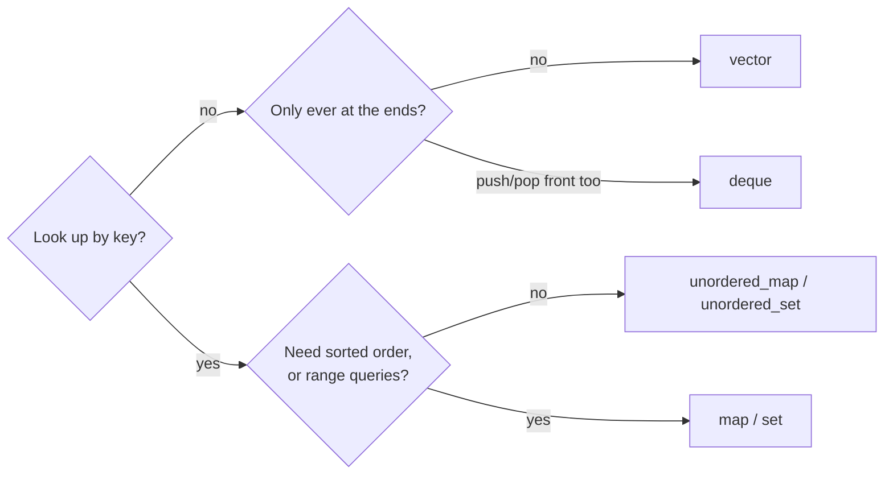
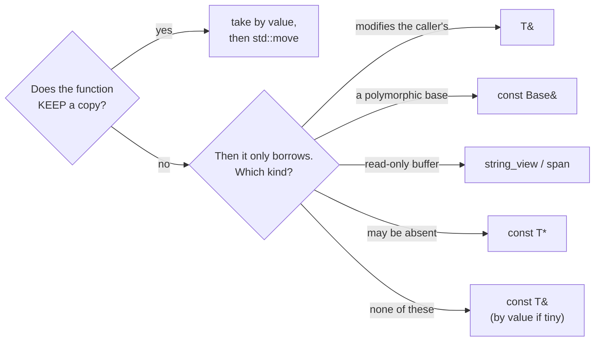
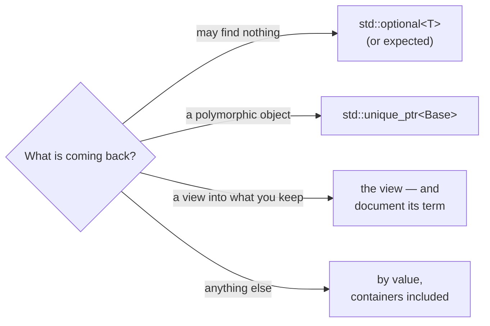
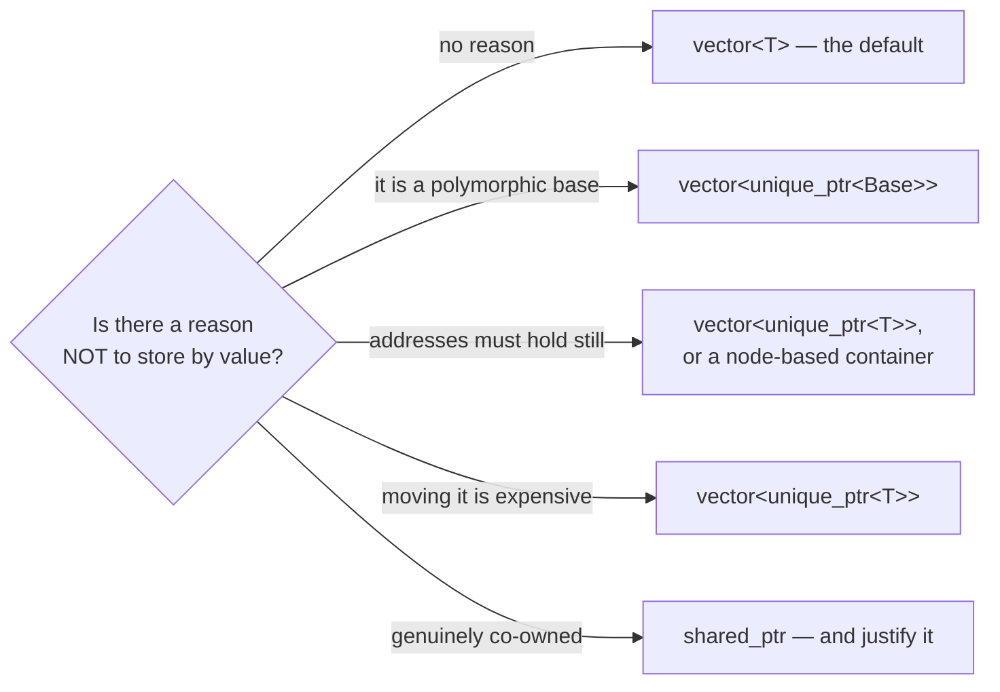

## Appendix H — Choosing: Signatures, Containers, and Storage

Four decisions stand between you and every function you will write in C++: which container holds this, how the function takes it, what it hands back, and — if it goes in a collection — whether it goes in as itself or behind a pointer. C# answered all four for you, identically, every time: a `List<T>` of references, a parameter that is a reference, a return that is a reference, and a collector to make lifetime somebody else's problem. Here each question has six or seven answers, the wrong one is usually silent, and you make the choice fresh in every signature.

This appendix is the procedure, for the moment you are at the keyboard rather than reading. The mechanisms live in the chapters and stay there — Chapter 2 owns value semantics, Chapter 6 moves, Chapter 10 views, Chapter 11 containers — and each branch below points at its owner. What is here and nowhere else is the *choosing*, plus the numbers behind it: everything this page claims about cost is asserted by `exercises/choosing/`, which `build_all.sh` runs on every push.

### The one question, asked four times

All four decisions are the same question at different scopes:

> **Who owns this, how long does it live, and who may see it?**

A **parameter** is a loan for the duration of the call — unless the function keeps a copy, in which case it is a transfer. A **return** is a new object you have given away — unless it is a view into something you kept, in which case it is a loan whose term the caller cannot see. A **container element** is ownership for the container's lifetime, plus one promise the reader never thinks to ask about until it bites: whether the element's *address* survives the container growing.

Chapter 33 named this vocabulary while debugging a dangling pointer — *"the loan sentence is everywhere once you look for it."* It is: the four procedures below are that sentence, written four ways.

---

### Procedure 1 — which container

Start here, because the other three lean on the answer.



That is the whole trunk. `vector` is the answer far more often than a C# developer expects, because contiguity beats theoretical complexity at every size that fits in cache (Chapter 11) — reach past it only when this table's right-hand column names something you actually need:

| Container | The C# you are reaching for | Take it when | Elements stay put? |
|---|---|---|---|
| `std::vector<T>` | `List<T>` | the default — indexing, iteration, growth at the end | **no** — growth moves everything |
| `std::deque<T>` | `Queue<T>` used at both ends | you push and pop at *both* ends | references survive end-insertion |
| `std::unordered_map<K,V>` | `Dictionary<K,V>` | keyed lookup, no ordering needed | **references yes**, iterators no (rehash) |
| `std::map<K,V>` | `SortedDictionary<K,V>` | sorted iteration, or "nearest key" queries | **yes** |
| `std::list<T>` | `LinkedList<T>` | splicing whole ranges; almost never otherwise | **yes** |
| `std::array<T,N>` | `T[]` with N known at compile time | fixed size, no heap block at all | **yes** |

The last column is the one no C# habit prepares you for, and procedure 4 spends it. In C# every collection holds references, so "does the element move?" is a question without meaning — the object never moves, only the reference to it is copied. Here a `std::vector<T>` holds the objects *themselves*, and growing it relocates every one:

```cpp
        std::vector<Counted> v;
        v.reserve(2);
        v.emplace_back("a");
        assert(FirstElementMovedOnGrowth(v));   // every pointer, reference and
    }                                           // iterator into it just died
```

> [!WARNING]
> **Trap:** `std::map` is the *tree* — sorted, O(log n). The `Dictionary<K,V>` equivalent is `unordered_map`. Reaching for `map` by name-recognition is the single most common container mistake a C# developer makes, and it costs an order of growth on every lookup.

### Procedure 2 — how to take a parameter

The question that decides everything is not "how big is it" but **does this function keep a copy?**



Branch by branch, with the reflex each one confronts:

| Branch | Spelling | Use it for | The C# reflex it confronts |
|---|---|---|---|
| **Sink** | `void Set(T v)` + `std::move` | setters, constructors, anything storing the argument | in C# you assign the reference and it is free; here the copy is real, and this shape lets the *caller* decide whether to pay |
| **Mutator** | `void Fill(T& out)` | genuinely modifying the caller's object | C#'s `ref`, but implicit at the call site — the reader cannot see it |
| **Polymorphic** | `void Draw(const Shape&)` | any base-class parameter | taking `Shape` by value **slices** (Chapter 2); C# cannot express the mistake |
| **View** | `void Log(std::string_view)` | read-only strings and buffers | `ReadOnlySpan<char>`; accepts literals, `std::string`, and substrings without allocating |
| **Optional** | `void Try(const T* p)` | "there may be nothing here" | a nullable reference — but here `nullptr` is the *only* signal, so document it |
| **Borrow** | `void Read(const T&)` | everything else you only look at | the default, and the closest thing to the C# feel |

**About `&&`.** You listed it among the options; the procedure deliberately never routes you there. An `&&` parameter is a tool for library authors — the move constructor and move assignment of the Rule of Five (Chapter 6), and overload pairs inside containers. In application code the sink shape above does the same job with one overload instead of two, and reads as intent rather than mechanism. Writing `void Set(T&& v)` in ordinary code usually means you wanted a sink and reached one layer too deep; the exception is when you are *writing* the Rule of Five, where Chapter 6 is the page you want.

**What the sink costs, exactly.** The recommendation is worth its cost only if you know the cost, so `exercises/choosing/passing.cpp` counts it. Against the obvious alternative — `const&` and assign — the sink wins where callers pass temporaries and loses one move where they pass lvalues:

| The caller passes | `void SetPayload(Counted c)` + move | `void SetPayloadByRef(const Counted&)` |
|---|---|---|
| a temporary | 0 copies, 1 move | **1 copy** |
| an lvalue it keeps using | **1 copy**, 1 move | **1 copy** |
| `std::move(x)`, done with `x` | 0 copies, **2 moves** | **1 copy** |

Two moves, in that last row, because `std::move` is a cast and nothing else (Chapter 6): one move constructs the parameter, one moves it into the member. For anything cheap to move — every standard container, every string — trading a copy for an extra move is the bargain the whole table exists to point at. For a type whose move is not cheap, take `const&` and copy once.

```cpp
class Widget {
public:
    void SetPayload(Counted c) { payload_ = std::move(c); }

    // The const& alternative, for comparison. It cannot steal: assigning
    // from a const reference copies, whatever the caller passed.
    void SetPayloadByRef(const Counted& c) { payload_ = c; }

private:
    Counted payload_;
};
```

> [!WARNING]
> **Trap:** a `string_view` or `span` parameter is a pointer and a length, and it keeps nothing alive. Storing one in a member outlives the call that supplied it — Chapter 10's dangling view, which the sanitizers will call a heap-use-after-free (Chapter 31). Views are for parameters; members own.

### Procedure 3 — what to return

The C# reflex here is the strongest of the four, because in C# returning is free: you hand back a reference and the collector handles the rest. Here the default answer is the opposite one, and it is also the right one.



**Return by value, including whole collections.** This is the branch a C# developer flinches at, and the flinch is obsolete. Returning a temporary outright is *elided* — since C++17 the object is constructed directly in the caller's storage, and no copy or move happens at all. Return a named local and you get the implicit move as the floor, with NRVO usually removing even that. The harness asserts both, and asserts them differently, because only one of them is guaranteed:

```cpp
        ResetTally();
        Counted c = MakeTemporary();
        assert(Tally().copies == 0);
        assert(Tally().moves  == 0);     // mandatory elision, C++17
        (void)c;
    }
    // --- returning a named local: never a copy; a move at worst -------------
    {
        ResetTally();
        Counted c = MakeNamed();
        assert(Tally().copies == 0);         // guaranteed: the implicit move
        assert(Tally().moves  <= 1);         // 0 with NRVO, 1 without - both legal
```

That `<= 1` is not hedging: NRVO is *permitted*, not required (Chapter 6), which is why the book's own CI checks what MSVC does with `/Zc:nrvo`. Returning a `std::vector<T>` costs nothing per element either — the vector's own move takes three pointers, and the harness asserts zero element copies.

So there is no reason to write C#'s out-parameter habit into C++. Returning several values is a `struct` or a `std::pair`, unpacked with structured bindings (Chapter 10) — not a fistful of `T&` parameters the caller must declare first and the reader cannot audit.

> [!TIP]
> **Key principle:** "I return by value and let elision do its job — including whole containers; an out-parameter is a C# habit that costs the caller a declaration and the reader a mystery."

### Procedure 4 — value or pointer, inside the container

Now the two halves meet: the container from procedure 1, holding what.



**Three independent reasons produce the same shape**, and the book teaches them in three different places without ever saying they are different reasons. Separating them is the point of this procedure:

1. **Slicing.** A `std::vector<Shape>` storing `Circle`s keeps only the `Shape` part — silently, virtuals included (Chapter 2, and Chapter 20's lab). If the element is a polymorphic base, the pointer is not an optimisation, it is the only correct answer.
2. **Address stability.** Growth relocates every element of a `vector<T>`, so any pointer, reference or iterator you kept is dangling — Chapter 33's whole ticket. Behind a `unique_ptr` the *pointers* move and the objects never do:

```cpp
        std::vector<std::unique_ptr<Counted>> v;
        v.reserve(2);
        v.push_back(std::make_unique<Counted>("a"));
        const Counted* object = v[0].get();     // a pointer to the OBJECT

        while (v.size() < v.capacity()) v.push_back(std::make_unique<Counted>());
        v.push_back(std::make_unique<Counted>());   // the same growth as above

        assert(object == v[0].get());   // the pointers moved; the object did not
        assert(!object->Payload().empty());        // ...and is still readable
```

3. **Cost of moving.** Reallocation move-constructs every element. The harness counts it: eight elements in a `vector<Counted>` cost **eight moves** on growth, while the same eight behind `unique_ptr` cost **zero** — only pointers were shuffled. For cheap-to-move types that is noise; for expensive or immovable ones it is the deciding number.

And the default remains `vector<T>`, by value. Boxing every element is the reflex C# installed — a `List<Widget>` really is a list of pointers to scattered heap objects — and importing it wholesale gives up the contiguity that made you choose C++ (Chapter 2's "a million points is one solid block"). Box for a reason from the list above, and write the reason down.

**A note on `shared_ptr`.** Chapter 1's rule stands here: `unique_ptr` unless you can explain why. A container of `shared_ptr` usually means the design has not decided who owns the elements, and "the container and also somebody else" is a decision, not an absence of one. The book recommends it without hesitation exactly once — Chapter 29's callback holder, where a `weak_ptr` on the other side asks "is this still alive?" — and that is the shape to hold it to.

> [!TIP]
> **Key principle:** "A collection holds objects by value until something forces otherwise — slicing, an address that must hold still, or a move too expensive to pay — and when I box the elements I write down which of the three it was."

### What this costs, counted

Every number on this page comes from `exercises/choosing/`, built and run under the canonical flags on every push. The instrument is Chapter 14's Tracer with the narration removed and the tally kept:

```cpp
struct Counts {
    int copies = 0;
    int moves  = 0;
};

inline Counts& Tally() {
    static Counts c;                 // Chapter 28's construct-on-first-use
    return c;
}
```

If a future toolchain makes one of these claims false, the build fails rather than the page quietly lying — which is the standard every other verified claim in this book is held to, and the reason this appendix is allowed to state costs at all.

### The four answers, on one line each

- **Container:** `vector` until a keyed lookup, an ordering, or a stable address says otherwise.
- **Parameter:** does it keep a copy? Sink by value and move. Otherwise borrow with `const&` — a view for read-only buffers, `T&` only to modify.
- **Return:** by value, always, including collections; `optional` if it can find nothing; document the term if you hand back a view.
- **Element:** by value, unless slicing, address stability, or move cost makes you box it — and then say which.

<!-- nav:begin -->
[← Appendix G — The Bridge Catalogue](G-the-bridge-catalogue.md) · [Contents](README.md)
<!-- nav:end -->
